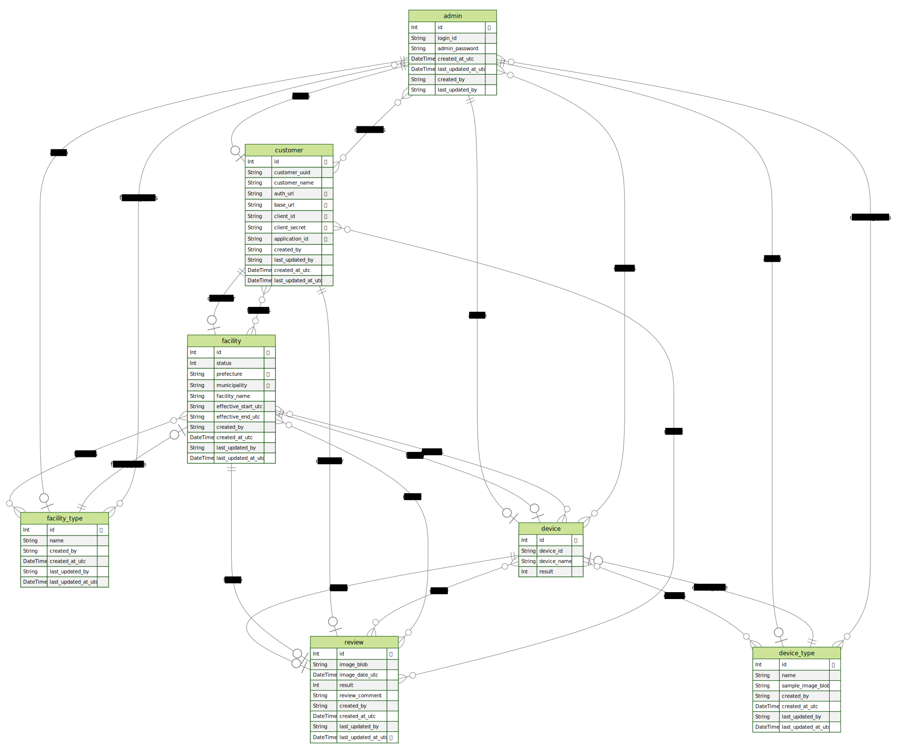

# Prisma in AAT

## About Prisma

* Prisma is an open-source ORM (Object-Relational Mapping) for Python, Node.js and TypeScript that helps to interact with database with ease.
* Here are some key points about Prisma:
  1. **Type Safety:** Prisma provides end-to-end type safety, which helps prevent runtime errors and enhances the developer experience.
  2. **Productivity:** With Prisma, you can quickly model your data and generate a fully type-safe client, increasing your development speed and productivity.
  3. **Database Agnostic:** Prisma supports multiple databases, including PostgreSQL, MySQL, SQLite, SQL Server, and MongoDB.
* Prisma is used in AAT

## Prisma Schema

* Prisma schema can be seen [here](./schema.prisma).

Following is the prisma Entity Relation Diagram (ERD) for visualization.



### Steps to generate ERD

* Generate ERD whenever there is change in Prisma schema.
* Commit ERD.svg

> INFO: Execute following commands from directory: backend/prisma

1. Include following snippet in [schema.prisma](./schema.prisma) file

    ```
    generator erd {
        provider = "prisma-erd-generator"
        output   = "./ERD.svg"
    }
    ```

2. Install ERD Generator package
    ```shell
    # from backend/prisma
    $ npm install prisma-erd-generator @mermaid-js/mermaid-cli
    ```
3. Generate client and ERD

> Make sure the backend environment is activated with prisma installed

    ```shell
    # backend/prisma
    $ prisma generate
    ```

4 Remove the code snippet added in Step 1. (Add code only when generating ERD file).

5. Discard the other generated files and folders from backend/prisma

An output file with the name ERD.svg is generated. (View in browser or any SVG viewer tools).

## Local Development

There are two copies of the prisma schema files.
1. [schema.prisma](./schema.prisma): Used in Cloud deployment. Uses SQL DB Server.
2. [schema.postgres.prisma](./schema.postgres.prisma): Used in Local deployment. Uses Postgres DB Server.

Keep both the files (models) in sync if intention is make changes available for both local and cloud deployment

Also, keep the files in caat-helper [prisma directory](./../../tools/caat-helper/src/data/prisma) in sync, if needed.
