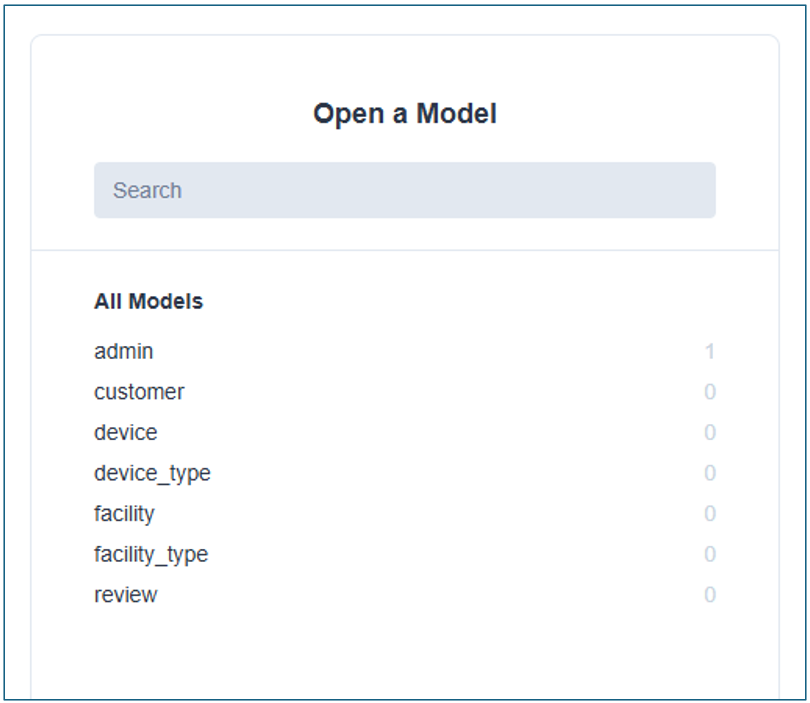

== DBの操作

* CAAT Helper(`caat-helper`) とはpythonのパッケージです。 CAATデータベースとやり取りするコマンドライン インターフェースを提供します。
* CAAT Helperは以下を実行します:
  ** DBへ入力するExcelデータの読み込み (管理者・カスタマーの詳細)
  ** 管理者パスワードのリセット
  ** DBのクリーンアップ
  ** コントラクターアプリURLのQRコードを作成

CAAT Helperを使用してローカルのDB (開発中)　及びクラウドのDB (本番・実際の設定中)を設定します。

[[enable-db-public-access]]
=== DBの公開アクセスを有効にする

* データ操作のためデータベースへのアクセスの公開を有効にするには、以下のコマンドを実行します:

[注記]
====
caat-helperコマンドを実行する前にデータベースの航海アクセスを必ず有効にしてください。
====

[source,shell]
----
# from tools/cloud-setup/aws
$ bash enable-db-public-access.sh
----

=== インストール
以下のコマンドを実行して仮想環境を作成し、 `caat-helper` パッケージをインストールします。

==== 仮想環境の作成

[source,shell]
----
# from tools/cloud-setup/aws
$ python3 -m venv .venv
----

[[activate-virtual-environment]]
==== 仮想環境のアクティベート

[source,shell]
----
# from tools/cloud-setup/aws
$ source .venv/bin/activate
----

==== `caat-helper` パッケージをインストールする

[source,shell]
----
# from tools/cloud-setup/aws
# Upgrade pip
$ pip install -U pip

# Install CAAT helper package
$ pip install ../../caat-helper/
----

[[set-environment-variables]]
=== 環境変数の設定

* コマンドの実行には以下の環境変数が必要です。

  - DATABASE_URL (Postgresデータベース接続文字列).
  - APP_SECRET_KEY (URLトークンに署名し、カスタマー認証情報を暗号化するための暗号化キー)

* 環境変数を設定するには以下のコマンドを実行します。

[注記]
====
Caat-helperコマンドを実行する前に、環境変数スクリプトの設定を必ず実行してください。
====

[source,shell]
----
# from tools/cloud-setup/aws
$ source set-env-var.sh
----

=== Prismaクライアントの作成(1度のみ)

以下のコマンドを実行してprismaクライアントを作成します。

警告: 他のcaat-helperコマンドを実行する前に必ずこのコマンドを初めに、そして1度のみ実行してください。

[source,shell]
----
# from tools/cloud-setup/aws
(.venv) $ caat-helper-init
----

=== Excelファイルの作成

* ExcelのテンプレートとExcelのサンプルファイルを作成します。 

* 現在のワーキングディレクトリ内にExcelファイルを作成するには、以下のコマンドを実行してください:

[source,shell]
----
(.venv) $ caat-helper db export-template
----

* 上記のエクスポートコマンドは2つのファイルをアウトプットします。
  ** `SIerData_template.xlsx` : データを記入するExcelのテンプレートファイル
  ** `SIerData_template.xlsx` : 参照用のExcel内のサンプルデータを含むExcel サンプルファイル

=== Excel fileを準備する

* Excelテンプレートが作成されると、有効なデータがシートに入力されます。

[注記]
====
* Codespacesを使用する場合、Excelファイルをホストマシンにダウンロードする必要がある場合があります。
* データが準備できたらホストマシン内のExcelファイルを編集し、Codespacesにアップロードし直します。
====

* 各シートに含まれている項目、及びその目的については以下の章を参照してください。

include::excel-readme-ja.adoc[Excel Instructions]

=== データのDBへの入力

* 作成されたテンプレートに必要な詳細が入力されたら、以下のコマンドを実行してデータをデータベースに入力します。

* 特にシート: `customer` でauth_url, base_url, client_id, client_secretのようなカスタマー認証情報は、後ほど管理者アプリUIに追加・更新される場合があります。

==== Excelを使用する入力

[source,shell]
----
# e.g.,
# caat-helper db populate --excel-path SIer-Data.xlsx
(.venv) $ caat-helper db populate --excel-path '/path/to/excel'
----

=== Prisma Studioを使用したDBデータを表示

* データベースへ入力するデータの表示・確認は以下のコマンドを実行します:

[source,shell]
----
# from tools/cloud-setup/aws
(.venv) $ prisma studio --schema=../../caat-helper/src/data/prisma/schema.postgres.prisma
----

* 上記のコマンドを実行すると、ウェブブラウザでスタジオビューアが開くので、許可してください。
* Prisma studioを開いたら、以下のモデルが表示されます:

* 任意のモデルをクリックしてデータを閲覧します。
* Studioインスタンスを閉じるには、上記のコマンドが実行された端末で `ctrl+c` を実行します。
