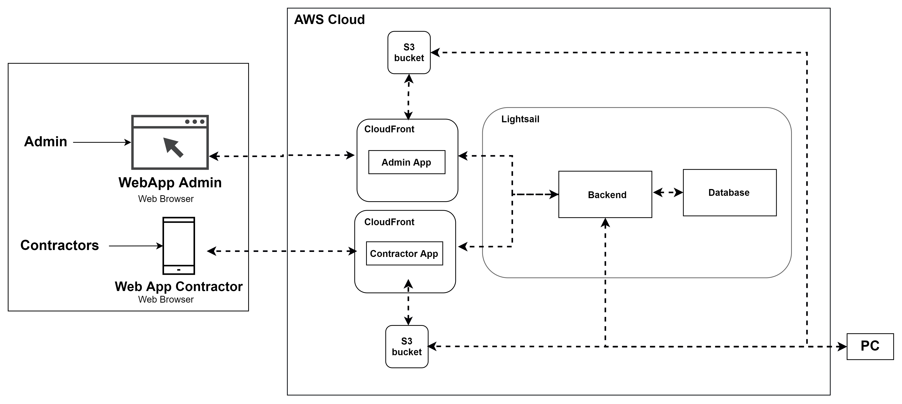

== 導入編

=== クラウドアーキテクチャ

以下の表はAATで使用するリソースとその目的、及びリソースの設定を示しています。

[cols="1,2,1"]
|===
|リソース |目的 |リソース構成

|S3バケット
|ストレージサービスには、管理者・コントラクターアプリ用のウェブアプリのソースコードが含まれます。
|S3スタンダード

|CloudFront
|CDNサービスでは、S3バケットから管理者・コントラクターアプリ用のウェブアプリを提供します。
|無料プラン

|Lightsailバックエンド
|AATのREST APIを提供するDockerコンテナサービス
|Micro, vCPU: 0.25, メモリ: 1GB, データ転送クォータ: 500GB

|Lightsail データベース
|管理者、カスタマーそしてアプリのレビューを含むPostgres SQL向けのデータベースサービス。
|Micro, 40GB, エンジン: MySQL/PostgreSQL, vCPU: 1, メモリ: 1GB, データ転送クォータ: 0.1TB

|===

[注意]
====
*link:https://calculator.aws/#/[AWS Pricing Calculator^] を参照し、最新のコスト見積もりに必要なリソースを追加します。
====
