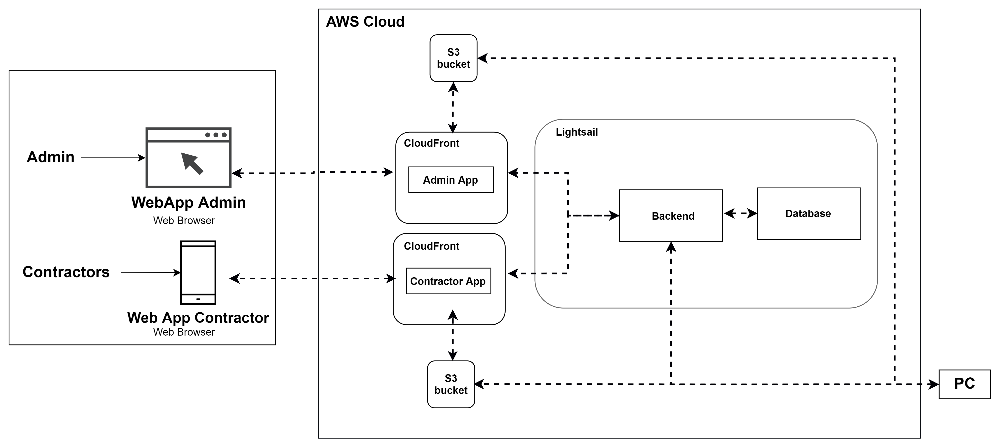

== Introduction

=== Cloud Architecture

The following table describes the resource used in AAT, the purpose of the resource and resource configuration.

[cols="1,2,1"]
|===
|Resource |Purpose |Resource Configuration

|S3 Bucket
|Storage service containing the web application source codes for Admin and Contractor App.
|S3 Standard

|CloudFront
|CDN Service serving web application for Admin and Contractor App from S3 Bucket.
|Free Tier

|Lightsail Backend
|Docker Container service which serves the REST API of AAT.
|Micro, vCPU: 0.25, Memory: 1GB, Data Transfer Quota: 500GB

|Lightsail Database
|Database service for Postgres SQL which contains the information about the admin, customers and application reviews. It also stores the Sample and Captured images of the Cameras.
|Micro, 40GB, Engine: MySQL/PostgreSQL, vCPU: 1, Memory: 1GB, Data Transfer Quota: 0.1TB

|===

[NOTE]
====
* Please refer to the link:https://calculator.aws/#/[AWS Pricing Calculator^] and add the resource as required for latest cost estimate.
====
