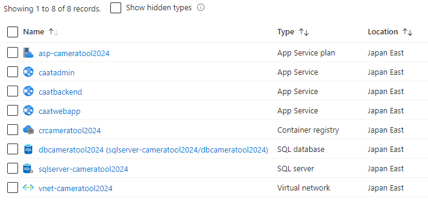

== Environment Setup

This page provides instructions to setup the AAT Application in Cloud.

- It is recommended to use link:https://docs.github.com/en/codespaces/overview[GitHub Codespaces^] to set up Azure cloud environment. Alternatively, an Ubuntu machine will also work.
- Ensure that your host machine has access to Azure and that it can connect to the database port (Port: 1443).

[NOTE]
====
To upgrade existing AAT instance from previous version, please visit the <<version-upgrade,Version Upgrade>> section.
====

[[prerequisites]]
=== Prerequisites

* Make sure to install following softwares before proceeding to next step
** Ubuntu 20.04 (Tested on v20.04.6 LTS)
** Python 3.10 (Tested on v3.10.12)
** link:https://docs.docker.com/engine/install/ubuntu/[Install Docker Engine on Ubuntu^] (Tested on v26.1.4-1)
*** After Docker is installed, to configure Docker as non-root user, see link:https://docs.docker.com/engine/install/linux-postinstall/#manage-docker-as-a-non-root-user[Manage Docker as a non-root user^]
** link:https://learn.microsoft.com/en-us/cli/azure/install-azure-cli-linux?pivots=apt[Install the Azure CLI on Linux^] (Tested on v2.60.0)
** link:https://jqlang.github.io/jq/download/[Install `jq` JSON Processor Tool^] (Tested on v1.6)
* On Cloud side, a Azure Login Credentials with working Azure Subscription are required.

=== Cloud Environment Setup

All the commands executed in this section assumes `tools/cloud-setup/azure` as working directory.

[NOTE]
====
Open another terminal where repository is cloned so that the following commands can be executed.
====

==== Environment File

* Update following Environment Variables in _.env_ file
* Replace the PLACEHOLDER_* values with actual values in _.env_ file
* Please refer _.env.example_ file which has the example values
* To avoid conflicts with existing resources in Azure, it is recommended to use unique values for all fields in the `.env` file.
* Following table describes the Environment variables used with the example values.

[cols="1,2,2,1"]
|===
|Variable |Usage |Valid Character Set | Example Values

|APP_NAME
|This Application name will be used while naming Cloud Services. Make sure to make this as unique name.
| `A-Z`,`a-z`,`0-9` +
Length: 4-40 Characters +
| cameratool2024, caat2024

|LOCATION
|Cloud Instance will be created in this region.
| Execute this command to list all possible values. +
`az account list-locations -o table` +
| japaneast, japanwest, eastus

|BACKEND_NAME
|This name will be used to create BackendServer in App Service. It will appear as https://BACKEND_NAME.azurewebsites.net. Make sure this value is unique across Azure globally.
| `A-Z`,`a-z`,`0-9`, '-' +
Length: 2-60 Characters +
Name can only contain alphanumeric characters and hyphens, it cannot start or end in a hyphen.
| caatbackend, caatbackendserver, caatbackendapp.

|WEBAPP_NAME
|This name will be used to create ContractorApp in App Service. It will appear as https://WEBAPP_NAME.azurewebsites.net. Make sure this value is unique across Azure globally.
| `A-Z`,`a-z`,`0-9`, '-' +
Length: 2-60 Characters +
Name can only contain alphanumeric characters and hyphens, it cannot start or end in a hyphen.
| caatwebapp, caatcontractor, caatcontractorapp.

|WEBADMIN_NAME
|This name will be used to create AdminApp in App Service. It will appear as https://WEBADMIN_NAME.azurewebsites.net. Make sure this value is unique across Azure globally.
| `A-Z`, `a-z`, `0-9`, '-' +
Length: 2-60 Characters +
Name can only contain alphanumeric characters and hyphens, it cannot start or end in a hyphen.
| caatwebadmin, caatadminapp, caatadmin.

|APP_SECRET_KEY
|A Strong key with 32 characters containing ONLY AlphaNumeric Characters. This key is used to sign the JWT and encrypt/decrypt the credentials. +
| `A-Z`, `a-z`, `0-9` +
Run following command to generate: +
`openssl rand -base64 24` +
| "hMnkHhOm6oh3w63zzu6s8FmHRQnreWrh"

|AZURE_SUBSCRIPTION_ID
|Subscription ID of the Azure Cloud where AAT Instance will be deployed.
|
|123cdef6-1234-1234-bc2e-abc4566322bd

|SQL_DATABASE_PASSWORD
|A Strong Password for the SQL Server Admin.
| `A-Z`, `a-z`, `0-9`, `!`, `$`, `#`, `%`, `@` +
Length: 8-128 Characters +
| "V3ry5tr0ngSq1ServerPa55"

|===

* Azure Cloud services will be named using values from `.env` as follows,

[cols="1,1"]
|===
|Resource Type | Resource Name

|Resource Group
| `rg-APP_NAME`

| Virtual Network
| `vnet-APP_NAME`

| Subnet for SQL Server
| `subnet-APP_NAME`

| SQL Server
| `sqlserver-APP_NAME`

| SQL Database
| `dbAPP_NAME`

| App Service Plan
| `asp-APP_NAME`

| Azure Container Registry
| `crAPP_NAME`

| App Service for Backend Server
| `BACKEND_NAME`

| App Service for Admin App
| `WEBADMIN_NAME`

| App Service for Contractor App
| `WEBAPP_NAME`

|===

[NOTE]
====
The values in `tools/cloud-setup/azure/.env` must be kept same throughout the AAT setup in cloud.
====

==== Cloud Setup

[NOTE]
====
* Make sure to login to the Azure account in Azure CLI with sufficient permissions to create the resources.
* Refer following links to login to Azure CLI.

- link:https://learn.microsoft.com/en-us/cli/azure/authenticate-azure-cli-interactively[Sign in interactively with Azure CLI^]
- link:https://learn.microsoft.com/en-us/cli/azure/authenticate-azure-cli-service-principal[Sign in with a service principal using Azure CLI^]
====

* Execute following command to make sure login is successful and the subscription details are shown in the output.

[source,shell]
----
$ az account show
----

[NOTE]
====
By default the Admin App user session is maintained for 1440 minutes, if it is to be changed, please make an edit in `tools/cloud-setup/azure/arm-template-caat.json`. Check for the field DEFAULT_JWT_EXPIRED_MINUTES and update the value in minutes.
====

* Execute the `cloud-setup.sh` to create cloud instance in Azure. Cloud Instance creation may take around 10 minutes.

[source,shell]
----
# from tools/cloud-setup/azure
$ bash cloud-setup.sh
----

Upon successful execution of the script, cloud instance and resource must be created.
Verify by visiting Azure Portal.

Following is the reference table. The first value in the `Example Values` column is shown here as example.

**Resource Group:** rg-cameratool2024

[NOTE]
====
* When the resources are created in Azure, auto scaling of resources is not enabled.
====
