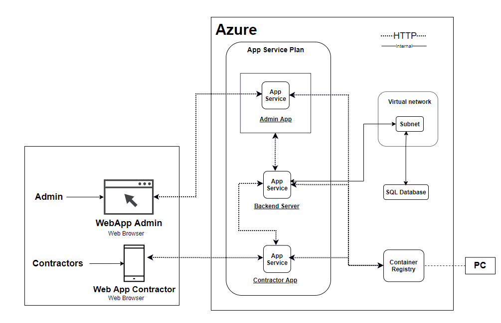

== 導入編

=== クラウドアーキテクチャ

[cols="1,3"]
|===
|リソース |説明

|Azureアプリサービス
|管理者およびコントラクターアプリのバックエンドサーバー・Webアプリケーションとして機能するWebアプリサービス。

|仮想ネットワークおよびサブネット
|サブネット内のリソースに安全にアクセスするためのネットワークサービス。サブネットはデータベースへのアクセスを制限することで、アプリサービスからのみアクセスできるようにします。

|SQLデータベース
|管理者、カスタマーおよびアプリケーションのレビューに関する情報を格納するSQLサーバー用のデータベースサービスです。また、カメラのサンプルやキャプチャ画像も保存されます。

|コンテナレジストリ
|管理者、バックエンド、コントラクターアプリのDockerイメージをホストするDockerイメージストレージサービス

|===
