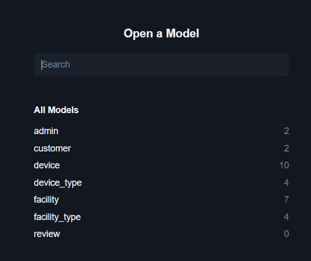

== データベースの初期化

* CAAT-helper(`caat-helper`) はpythonのパッケージの１つで、CAATデータベースと相互作用するコマンドラインインターフェイスを提供します。
* caat-helperは以下のことを実行できます:
  ** DBに生成されるエクセルデータ(管理者およびカスタマーの詳細)の読み込み
  ** 管理者パスワードのリセット
  ** DBの消去

=== インストレーション
以下のコマンドを実行して仮想環境を作成し、 `caat-helper` パッケージをインストールします。

==== 仮想環境の作成

[source,shell]
----
# from tools/cloud-setup/codespaces
$ python3.10 -m venv .venv
----

[[activate-virtual-environment]]
==== 仮想環境のアクティベート

[source,shell]
----
# from tools/cloud-setup/codespaces
$ source .venv/bin/activate
----

==== `caat-helper` パッケージのインストール

[source,shell]
----
# from tools/cloud-setup/codespaces
# Upgrade pip
$ pip install -U pip

# Install CAAT helper package
$ pip install ../../caat-helper/
----

[[set-environment-variables]]
=== 環境変数の設定

* コマンドの実行には以下の環境変数が必要です。

  - DATABASE_URL (SQLサーバーデータベースの接続文字列)
  - APP_SECRET_KEY (URLトークンにサイン、及びカスタマー認証情報を暗号化する暗号化キー)

* 環境変数を設定するために以下のコマンドを実行します

[注記]
====
caat-helperコマンドを実行する前に、必ずセット環境変数スクリプトを実行してください。
====

[source,shell]
----
# from tools/cloud-setup/codespaces
$ source set-env-var.sh
----

=== prismaクライアントの作成 (一度のみ)

クライアントの生成は、以下のコマンドを実行します。

注意: caat-helper以外のコマンドを実行する前に、必ず初めにこのコマンドを1回のみ実行してください。

[source,shell]
----
# from tools/cloud-setup/codespaces
(.venv) $ caat-helper-init
----

=== 管理者アカウントの作成

* 以下のコマンドを実行して、管理者アカウントを作成します。
* 管理者アカウントのログインIDとパスワードをコマンドのパラメータとして提供してください。
* ログインIDとパスワードの命名規則については、下の表を参照してください。

警告：パスワードは必ず覚えておいてください。パスワードが設定されると、再取得することはできません。リセットのみが可能です。

[%noheader, cols="1,2,2"]
|===
|**欄名** ^| _login_id_ ^| _admin_password_

|**説明**
|**必須フィールド** +
管理者が管理者アプリへのログインに使用する固有ID (この欄には固有値が含まれます) です。
|**必須フィールド** +
管理者アプリにログインするための管理者パスワード。

|**文字の詳細**
|スペースを含まない英数字と `。` を除く日本語文字がサポートされています。 +
許可される特殊文字はハイフン `-`, アンダースコア `_` です。 +
長さ: 1～255 文字。
|パスワードが以下の条件を満たすことを確認してください: +
1. 長さ8文字以上 +
2. 以下のカテゴリーのうち3カテゴリーからの文字を含むこと +
    a. 小文字 (a-z) +
    b. 大文字 (A-Z) +
    c. 数字 (0-9) +
    d. 特殊文字 (`_`, `-`, `!`, `$`, `#`, `%`, `@`) +
3. スペースが入っていないこと +

|**サンプル値**
|aat-admin
|ajatmd11Arug500TAeCne
|===

[source,shell]
----
# from tools/cloud-setup/codespaces
(.venv) $ caat-helper db create-admin -id <loginid> -p <password>
----

=== Prisma Studioを使用してDBデータを表示する

* データベースに格納されているデータを表示/確認するには、以下のコマンドを実行してください：

[source,shell]
----
# from tools/cloud-setup/codespaces
(.venv) $ prisma studio --schema=../../caat-helper/src/data/prisma/schema.postgres.prisma
----

* 上記のコマンドを実行すると、ウェブブラウザでスタジオビューアが開くので、許可してください。
* Prisma studioを開いたら、以下のモデルが表示されます:

* データを表示するには、管理者モデルをクリックしてください。データ入力後は、他のモデルも同様の方法で表示できます。
* Studioインスタンスを閉じるには、上記のコマンドが実行された端末で `ctrl+c` を実行します。
