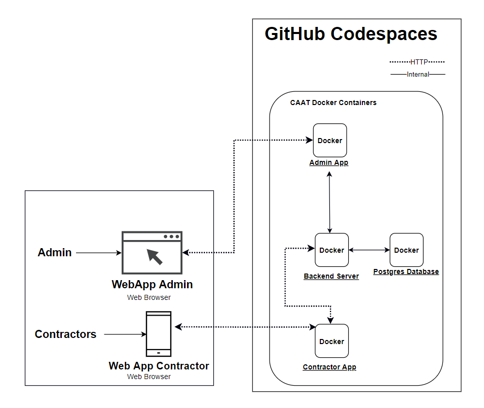

== はじめに

=== ブロック図

[cols="1,3"]
|===
|ブロック |説明

|バックエンドサーバー
|Dockerで実行されるバックエンドサーバーは管理者・コントラクターアプリにAPIを提供します。

|コントラクターアプリ
|Docker上でコントラクターアプリとして動作するWebアプリケーション。

|管理者アプリ
|Docker上で管理者アプリとして動作するWebアプリケーション。

|Postgresサーバーデータベース
|Dockerから実行されるPostgresサーバーのデータベースには管理者、カスタマー、そしてアプリケーション申請についての情報が含まれています。またカメラのサンプル画像や撮影画像も格納されています。

|===
