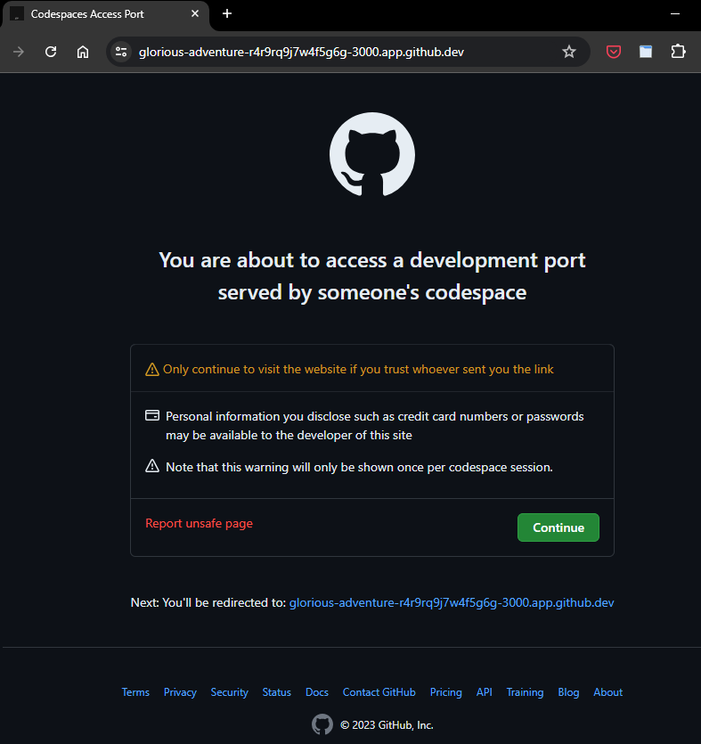

[[post-setup]]
== セットアップ後

* `caat-helper`コマンドを実行する前に、以下を確認してください:
** <<activate-virtual-environment, Activate virtual environment>>
** <<set-environment-variables, Execute set environment variable script>>

=== AATセットアップの確認

* リンクがライブかどうかを確認するために以下のスクリプトを実行します

[source,shell]
----
# from tools/local-setup-codespaces
$ bash verify-modules.sh
----

* この時点ですべてのモジュールはライブできちんと動作しています。

=== アプリケーションURLの取得

==== 管理者アプリURLとコントラクターアプリURL

* 以下のコマンドを実行して、管理者アプリURLとコントラクターアプリURLを表示します。

[source,shell]
----
# from tools/local-setup-codespaces
$ bash print-local-app-url.sh
----

ターミナルに表示されたURLをメモしてください。使用方法については次章を参照してください。

==== コントラクターアプリと施設のQRコードの生成

* コントラクターアプリで使用するデータがデータベースに入力されたら、QRコードを生成します。
* コントラクターアプリはQRコードをスキャンすることによってのみ開くことができます。

* コントラクターアプリおよび選択可能な施設のQRコードの作成には、以下のコマンドを使用してください。+
このコマンドを使用することで、'QRコード'ディレクトリ内にすべての施設のQRコードを一度に作成することができます。

* 以下のコマンド内の前のコマンドアウトプットからコントラクターアプリURLを置き換えます。

[source,shell]
----
# # from tools/local-setup-codespaces
(.venv) $ caat-helper qr generate -u {PLACEHOLDER_CONTRACTOR_APP_URL}
----

==== アプリユーザーガイド

* 管理者アプリの使用方法については、 -  `管理者ユーザーガイド`メニューを参照してください。

* コントラクターアプリの使用方法については、 - `コントラクターユーザーガイド`メニューを参照してください。

[注記]
====
URLをブラウザで開くと、ユーザーにはポートアクセスを確認するためのプロンプト (初回のみ)が表示されます。`続行`ボタンをクリックして進めてください。

====

これによりGitHub Codespaces内のAATアプリケーションのセットアップは完了します。 +

アプリケーションの使用を開始してください。

[注記]
====
アプリURLポートは公開されていて、コントラクターがアクセスできるようリンクが共有されます。
====

=== 選択したデータをデータベースに追加する

* クラウドの初期設定が完了しデータが追加されると、既存のデータベースに、さらに多くの機器や設備、または新規カスタマーを追加する必要性が出てくる場合があります。
* 施設、デバイス、カスタマーなどの選択可能なデータは、caat-helperによりデータベースへ追加できます。

[注記]
====
* 既存のデータの更新は`caat-helper`ではサポートされていません。
* 例：初期データを追加。管理者１はカスタマー１に関連付けられている +
次に、管理者２が追加され、それをユーザーがカスタマー１にアサインしたい場合 +
それはサポートされていません。
====

==== エクセルを使ってデータを追加する

* .最初にデータベースに入力するために使用したエクセルファイル内の各シート (施設、カスタマー、デバイス) へデータを追加し、以下のコマンドを実行します。

* `caat-helper`コマンドを実行する前に、以下のことを確認してください:
    ** <<activate-virtual-environment, Activate virtual environment>>
    ** <<set-environment-variables, Execute set environment variable script>>

[source,shell]
----
$ (.venv) caat-helper db populate --excel-path '/path/to/excel'
----

=== 管理者パスワードのリセット

* 管理者パスワードをリセットするためにcaat-helperはコマンドライン機能を提供します。
* 以下のコマンドを使用して管理者とそのログインIDのリストを作成します。

* `caat-helper`コマンドを実行する前に、以下のことを確認してください:
    ** <<activate-virtual-environment, Activate virtual environment>>
    ** <<set-environment-variables, Execute set environment variable script>>

[source,shell]
----
(.venv) $ caat-helper db list-admin
----

パスワードのリセットには以下のコマンドを使用します
[source,shell]
----
(.venv) $ caat-helper db reset-pass --login-id {admin-login-id} --password {new-pasword-value}
----

=== データベースからのデータの消去

* `caat-helper`コマンドを実行する前に、以下のことを確認してください:
    ** <<activate-virtual-environment, Activate virtual environment>>
    ** <<set-environment-variables, Execute set environment variable script>>

[注記]
====
*使用の際にはご注意ください*

* caat-helperを使用することで、データベースからすべてのデータを一度に削除できます。 +
現段階でcaat-helperは選択されたデータの消去をサポートしていません。

* データベースを消去するには、以下のコマンドを使用してください。
[source,shell]
----
(.venv) $ caat-helper db clear
----
====

=== Stop/Restart the AAT Local Instance

==== AATインスタンスの停止
* ローカスインスタンスを停止するために以下のコマンドを実行します。
* これによりサービスが停止します。

[source,shell]
----
# from tools/local-setup-codespaces
$ bash caat-local-stop.sh
----

==== AATインスタンスの再スタート
* ローカルインスタントを再スタートするには、以下のコマンドを実行します。
* これにより同じURLですべてのサービスが再度開始します。

[source,shell]
----
# from tools/local-setup-codespaces
$ bash caat-local-start.sh
----
