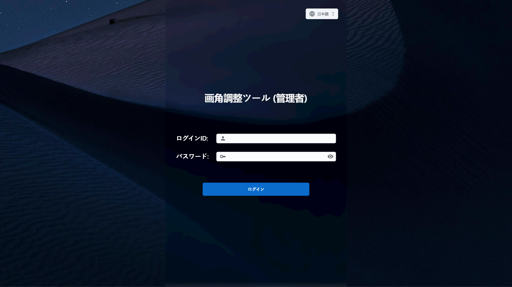
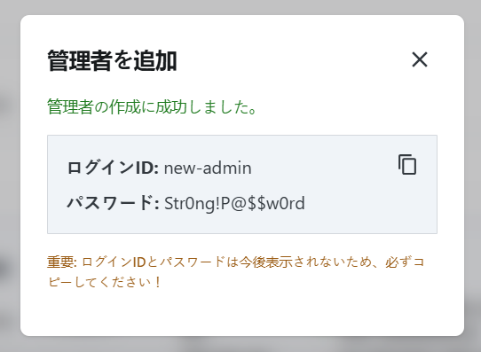
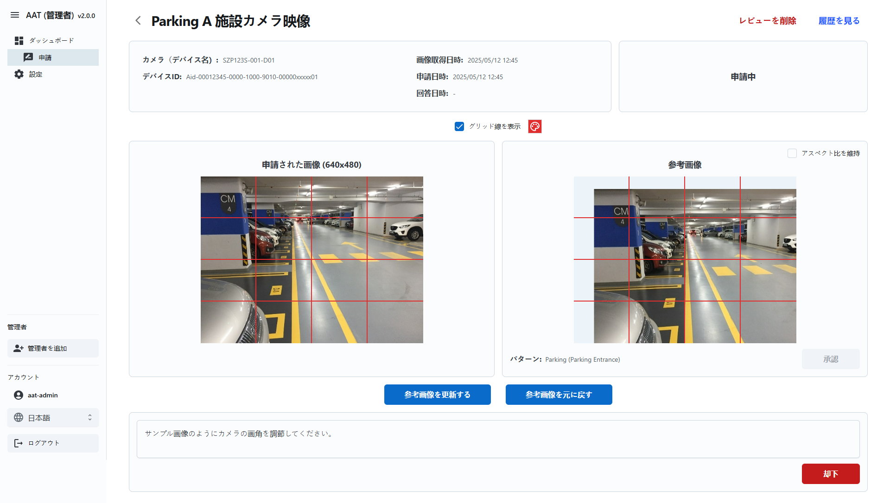
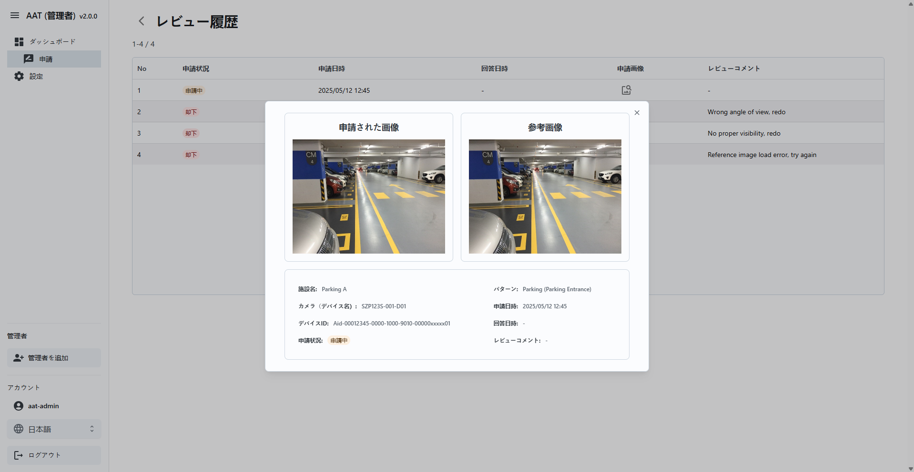

= AAT管理者アプリユーザーガイド
:docinfo: shared
:doctype: book
:data-uri:
:title: Angle Adjustment Tool (AAT) - Admin App User Guide
:revdate: 2025 - 05 - 19
:revnumber: 2.0.0
:toc: left
:toclevels: 3
:toc-title: Table of Contents
:sectanchors:
:sectlinks:
:sectnums:
:multipage-level: 2
:icons: font
:encoding: utf-8

== 推奨環境と使用上の注意

管理者アプリの推奨環境

=== 操作環境の確認

* OS: Windows
* ブラウザ: Chrome

=== 推奨ディスプレイ設定

* ディスプレイ設定
  ** 解像度: 1920 x 1080
  ** 倍率: 100 %

* ブラウザ
  ** 倍率: 100 %

== ワークフロー

以下の図は管理者アプリの典型的なワークフローについて説明しています:

.管理者アプリのワークフロー

1. **ログイン:** 管理者ユーザーはログイン認証情報を使用してアプリケーションにログインすることから始めます。
2. **ダッシュボード:** ログイン後、管理者は申請を閲覧・フィルターできるダッシュボードへと移動します。
  * **管理者追加:** 管理者は新しい管理者ユーザーを作成できます。
  * **申請のレビュー**
   - レビューページに移動し、申請を承認または却下します。
   - 提出された画像を参照画像と比較します。
   - 必要に応じて提出された画像を調整し、新しい参照画像として保存します。
3. **設定:** 管理者はカスタマーデータとデバイスを管理できます。
   - **カスタマーの追加/編集:** カスタマーの認証情報を作成または更新します。
   - **QRコードの生成:** 施設用のQRコードを作成します。
   - **デバイスの管理:** カスタマーのデバイスを追加または削除し、各デバイスに施設とデバイスタイプを割り当てます。
   - **データのインポート/エクスポート:** カスタマーおよびデバイスデータをJSON形式でアップロードまたはダウンロードします

== ログイン

管理者アプリへのアクセスにはURLが必要です。URLはクラウド・システム管理者より入手できます。
URLを入手したら、Webブラウザ上で開いてください。

.管理者ログイン

AAT管理者ポータルにログインするには、有効な `ログインID` と `パスワード` を入力し、 `ログイン` をクリックします

* **ログインID:** ログインIDはクラウド・システム管理者より提供されます。
* **パスワード:** パスワードは、クラウド・システム管理者より提供されるパスワードです。

== クイックデータベース入力

* このセクションでは、管理者がデータベースにすべてのデータを迅速に追加する方法について説明します。
* カスタマー、施設、施設タイプ、デバイスタイプおよびそれぞれの参照画像を追加することができます。
* デバイスは、カスタマーの認証情報に関連付けられたAITRIOSプロジェクトより取得されます。
* デバイス接続状況は、デバイスをAATに登録するかどうかを決定するのに役立ちます。

=== 設定
* このセクションでは、管理者がカスタマーの認証情報とデバイスを管理する方法について説明します。
* 管理者はカスタマーの認証情報を追加/編集し、選択したカスタマーのデバイスを管理することができます。
* 管理者は選択したカスタマー用のQRコードを生成することができます。
* 管理者はカスタマー、デバイス、施設、施設タイプおよびデバイスタイプのデータをインポート/エクスポートすることができます。

==== カスタマーリストの初期状態

.空のカスタマーリスト

1. 管理者は`カスタマーを追加`をクリックして新しいカスタマーを追加することができます。
2. 管理者は`データをインポート`をクリックしてカスタマー、デバイス、施設、施設タイプおよびデバイスタイプのデータをインポートすることができます。

===== カスタマーを追加

.カスタマーを追加

1. **カスタマーの詳細:** フォームにカスタマーの詳細を入力します。
  * **カスタマー名:** カスタマーの名前を入力します。
  * **クライアントID:** AITRIOSポータルからのクライアントID
  * **クライアントシークレット:** AITRIOSポータルのクライアントシークレット。
  * **認証URL:** 認証URLを入力します。
  * **コンソールエンドポイント:** コンソールエンドポイントを入力します。
  * **アプリケーションID:** アプリケーションIDを入力します。

2. **次へ:** これによりカスタマーの認証情報が確認され、'デバイスの管理'ページに進みます。
3. **リセット:** これにより、これまでに入力した値がリセットされます。

認証情報を変更する場合、必要に応じて編集し、「保存」をクリックしてください。

==== カスタマーリストの入力

.カスタマーリスト

1. **編集:** このオプションでは、管理者はカスタマーの認証情報を編集することができます。管理者は'編集'をクリックしてカスタマーの認証情報を編集することができます。
2. **デバイスの管理:** このオプションでは、管理者が選択したカスタマーのデバイスを管理することができます。
3. **QRの生成:** このオプションでは、管理者が選択したカスタマーのためにQRコードを生成することができます。
4. **データのエクスポート:** このオプションを使用すると、管理者はデバイス、すべてのデバイスの施設、施設タイプ、デバイスタイプおよびそれぞれの参照画像を含むデータをエクスポートすることができます。ただし、デバイスの履歴はエクスポートデータには含まれません。
5. **Iデータのインポート:** この機能では、管理者がデバイス、施設、施設タイプおよびデバイスタイプのデータをインポートすることができます。ただし、このオプションはデータベース内の既存のデータを上書きするため、インポートする前に必ずデータのバックアップを取っておいてください。

=== デバイスの管理

* このセクションでは、管理者が選択したカスタマーのデバイスを管理することができます。管理者はデバイスを選択し、施設およびデバイスタイプに割り当てることができます。

.デバイスの管理

1. **カスタマーリスト:** このドロップダウンでは、管理者がデバイスを管理するカスタマーを選択することができます。リストは前のステップで追加されたカスタマーで構成されています。
2. **デバイス選択:** このチェックボックスでは、管理者が登録するデバイスを選択することができます。選択されたデバイスは、施設およびデバイスタイプのために一括編集することができます。登録済みおよび未登録のデバイスは削除することができます。また、各デバイスの接続状況が表示され、AITRIOSに接続されているデバイスを特定するのに役立ちます。
3. **施設の検索または作成:** このオプションでは、管理者が選択したデバイス用の施設を作成または選択することができます。
4. **デバイスタイプの検索または作成:** このオプションでは、管理者が選択したデバイス用のデバイスタイプを作成または選択することができます。
5. **デバイス登録/更新:** 各デバイスは施設およびデバイスタイプに関連付ける必要があります。管理者はデバイスを選択し、'デバイス登録/更新'をクリックして選択したデバイスを登録/更新ことができます。
6. **一括編集:** このオプションを使用すると、管理者は複数のデバイスの施設およびデバイスタイプを一度に設定することができます。管理者はデバイスを選択し、'一括編集'をクリックして施設およびデバイスタイプを設定することができます。
7. **デバイス登録解除:** このオプションでは、管理者が選択したデバイスを登録解除ことができます。管理者はデバイスを選択し、'デバイス登録解除'をクリックして選択したデバイスを登録解除ことができます。
8. **デバイスリストの更新:** 'デバイスリストを更新'ボタンをクリックすることでデバイスを更新することができます。これにより、デバイスのリストが更新され、最新の状態が表示されます。

==== 施設および施設タイプの追加

* このオプションでは、管理者が新しい施設および施設タイプを作成することができます。

.施設の追加

.施設タイプの追加

1. **施設名:** ここで、管理者は施設の名前を入力します。
2. **施設タイプ:** 施設タイプを作成またはドロップダウンから選択します。
  2.1 **施設タイプ名:** このオプションでは、管理者が新しい施設タイプを作成することができます。管理者は施設タイプの名前を入力し、’施設タイプを追加’をクリックして施設タイプを追加します。
3. **州:** このオプションでは、管理者が施設の州を選択することができます。
4. **市:** このオプションでは、管理者が施設の市を選択することができます。
5. **有効開始日:** これは、施設のQRコードが有効になる日付です。管理者はウィジェットから日付を選択します。
6. **有効終了日:** これは、施設のQRコードが期限切れになる日付です。管理者はウィジェットから日付を選択します。
7. **施設の作成:** このボタンにより管理者は施設を作成することができます。管理者は’施設を作成’をクリックして施設を作成します。

==== デバイスタイプの追加

* このオプションでは、管理者が新しいデバイスタイプを作成することができます。

.デバイスタイプの追加

1. **デバイスタイプ名:** 管理者がデバイスタイプの名前を入力します。
2. **参照画像:** このオプションでは、管理者がデバイスタイプのための参照画像をアップロードすることができます。管理者は’アップロード’ボタンをクリックして参照画像をアップロードします。
3. **追加:** このボタンでは、管理者がデバイスタイプを追加することができます。

=== QRの生成

* コントラクターアプリを起動するためにはQRコードが使用されます。コントラクターアプリのURLが施設の詳細と統合されています。QRコードがスキャンされると、特定の施設の詳細を持つコントラクターアプリが開き、設定が必要なデバイスのリストが表示されます。
* このセクションでは、管理者が選択した施設または特定のカスタマーのすべての施設用のQRコードを生成することができます。管理者はデバイスを選択し、`QRの生成` をクリックしてQRコードを生成します。

.QRの生成

1. **カスタマー名:** このオプションでは、管理者がQRコードを生成するカスタマーを選択することができます。
2. **施設名:** このオプションでは、管理者がQRコードを生成する施設を選択することができます。
3. **生成とダウンロード:** このボタンでは、管理者が選択した施設用のQRコードを生成することができます。特定のカスタマーに対して施設が選択されていない場合、そのカスタマーに属するすべての施設のQRコードが生成されます。選択したオプションに応じて、カスタマーと施設で区切られたzipファイルがダウンロードされます。

=== データのエクスポート

* 管理者は、デバイス、すべてのデバイスの施設、施設タイプ、デバイスタイプおよびそれぞれの参照画像を含むデータをエクスポートすることができます。ただしサイズの制約のため、デバイスの角度調整レビューはエクスポートデータには含まれません。
* このセクションでは、ログインしている管理者用のデータをエクスポートすることができます。管理者は’データをエクスポート’をクリックしてデータをエクスポートします。

.データのエクスポート

* **AAT_Data_ADMIN-NAME-HERE_YYYYMMDDHHMMSS.json**という名前形式のjsonファイルが自動的にダウンロードされます。
  * **ADMIN-NAME-HERE**は、ログインしている管理者の名前です。
  * **YYYYMMDDHHMMSS**は、データがエクスポートされた日時です。
  * 例: `AAT_Data_aat-admin_20250423094029.json`

=== データのインポート

* 管理者は、デバイス、すべてのデバイスの施設、施設タイプ、デバイスタイプおよびそれぞれの参照画像を含むデータをインポートすることができます。ただし、エクスポートデータ機能と同様に、デバイスの角度調整レビューはインポートデータには含まれません。
* このセクションでは、ログインしている管理者用のデータをインポートすることができます。
* 管理者はjsonファイルからデータをインポートすることができます。jsonファイルは、エクスポートされたデータと同じ形式である必要があります。

警告: データベースにデータをインポートすると、既存のデータが上書きされます。インポートする前に必ずデータのバックアップを取っておいてください。

.データのインポート

1. **アップロード:** 管理者はアップロードボタンをクリックしてJSONファイルをアップロードすることができます。
2. **インポート:** 選択したjsonファイルからデータをインポートします。管理者は `インポート` ボタンをクリックしてデータをインポートします。

== ダッシュボード

 **ダッシュボード** ページはログイン後に表示され、デバイスのアプリケーションリストが含まれています。

.ダッシュボードリストビュー
image::./admin-app-images-ja/dashboard_list.png[Admin Dashboard List <13>]

.ダッシュボードタイルビュー
image::./admin-app-images-ja/dashboard_tiled.png[Admin Dashboard Tiled <14>]

1. **名前とバージョン:** アプリケーションの名前と現在のバージョンです (AAT: 画角調整ツール)。
2. **サイドバーオプション:** ナビゲーションはダッシュボード・コンソール設定にリンクしています。
3. **言語トグル:** ドロップダウンからアプリケーションの言語を変更します
4. **アカウント名:** 管理者のログインID
5. **ログアウトボタン:** `ログアウト` をクリックしてアカウントからログアウトします。
6. **フィルター:** フィルターを使用して、申請リストから検索します。管理者は以下の要素に基づいてアプリケーションをフィルターします。:
  . `カスタマー名`
  * フィルター方法: ドロップダウンリスト (１つのみ選択可)
  * 説明: 選択したカスタマー名で検索をします
  * 使い方: ドロップダウンよりカスタマー名を選択してください

  . `都道府県`
  * フィルター方法: テキストボックス（部分入力可）
  * 説明: 入力したキーワードを含む都道府県名で検索します
  * 使い方: 都道府県名の全体または一部を含むキーワードを入力してください

  . `市区町村`
  * フィルター方法: テキストボックス（部分入力可）
  * 説明: 入力したキーワードを含む市区町村名で検索します
  * 使い方: 検索したい市区町村名を全て、または一部だけ入力してください

  . `施設名から探す`
  * フィルター方法: テキストボックス（部分入力可）
  * 説明: 入力したキーワードを含む施設名で検索します
  * 使い方: 検索したい施設名を全て、または一部だけ入力してください
  * 例:
  ** 施設として"Car Parking Lot"と"Bike Parking Lot"がある場合、
  ** "Car"を入力した時"Car Parking Lot"の施設が表示されます
  ** "Bike"を入力した時 "Bike Parking Lot"の施設が表示されます
  ** "Parking"を入力した時"Car Parking Lot" と "Bike Parking Lot"の施設が表示されます
  ** "Lot Parking"を入力した時 "Car Parking Lot" と "Bike Parking Lot"の施設が表示されます

[注記]
====
* 検索ボタン: 検索ボタンを使用することで、指定された条件 (カスタマー名、都道府県、市区町村、施設名)に基づいてフィルタを適用します。このアクションにより、入力されたフィルターの項目に一致する申請が表示されます。また、最新結果を取得するためのリロードボタンの代わりとしても機能します。
* クリアボタン: クリアボタンをクリックすると、適用されたフィルターがすべてリセットされ、デフォルトのフィルターなしですべての申請が表示されます。
====

[arabic, start=7]
1. **アプリケーションステータスのチェックボックス:** ステータスに基づいてアプリケーション一覧を表示するチェックボックスを選択します。
2. **詳細ボタン:** `詳細` をクリックし、特定のデバイスの最新の申請詳細を閲覧します。
3. **デバイスの接続状態:** `デバイスID` 欄のデバイスIDの左側はデバイスの接続状態を示しています。
  * 緑色の〇印: AITRIOSに接続済み
  * 赤色の×印: AITRIOSに接続されていない、もしくは ステータス不明
4. **リストビュー/タイルビュー:** ダッシュボードの表示方法は2種類あります。
  * リストビュー: 申請の一覧が行形式で表示されます。
  * タイルビュー:申請の一覧が申請されたカメラ画像のプレビューを含む欄形式で表示されます。プレビューのサイズは3種類から選べます:
    ** 小: 小サイズのサムネイルで多数のアイテムが表示されます。
    ** 中: 中サイズのサムネイルでアイテムが表示されます。
    ** 大: 大サイズのサムネイルで少数のアイテムが表示されます。
5. **管理者の追加:** ’管理者を追加’をクリックして新しい管理者ユーザーを作成します。

=== 管理者の追加
* このセクションでは、管理者が新しい管理者ユーザーを作成することができます。

.管理者の追加

* 管理者はフォームに `ログインID` と `パスワード` を入力することで、新規の管理者ユーザーを作成することができます。
* 管理者は’管理者を作成’をクリックして新しい管理者ユーザーを作成します。

.新規管理者が作成されました

* 管理者は新しい管理者の認証情報をコピーして共有することができますが、閲覧できるのは一度のみです。

=== 申請ページ

.申請の詳細
image::./admin-app-images-ja/review_details.png[Review Details <17>]

.グリッド線のカラーピッカー

1. **デバイスと申請の詳細:** 申請中のデバイスについての詳細を表示します。
2. **アプリケーションのステータス:** 現在のアプリケーションのステータスを表示します。
3. **画像のグリッド線:** ［グリッド線を表示］のチェックボックスをオンにすると、送信済みの画像、および参考画像にグリッド線が表示されます。チェックボックスの横のパレットボタンをクリックするとカラーピッカーが開き、グリッド線の色を変更できます。
4. **申請された画像:** コントラクターが確認用に提出した画像です。
5. **参考画像:** 申請中に提出した画像と比較するための参考画像です。
6. **アスペクト比の保持:** 有効にすると、参考イメージの元の寸法が保持されます。 無効にすると、参考イメージは送信したイメージの寸法に合うようリサイズされるため、結果的に画像が歪んだり、引き伸ばされたりする可能性があります。
7. **承認ボタン:** 確認後 `承認` をクリックして申請リクエストを承認します。
8. **却下ボタン:**  却下の理由をフィールド内に記載したら、 `却下` をクリックして申請リスエストを却下します。
9. **参考イメージの更新ボタン:** `参考イメージの更新` をクリックすると、ポップアップウィンドウが開き、送信済みのイメージをドラッグして調整し、新しい参考イメージとして保存することができます。
10. **参考イメージの復元ボタン:** `参考イメージの復元` をクリックすると、すべての変更が破棄され、最後に保存した参考イメージにリセットされます。
11. **履歴の閲覧:** `履歴の閲覧` をクリックすると、選択されたデバイスの申請データの履歴が閲覧できます。
12. **申請の削除:** ’申請を削除’をクリックしてデバイスの申請データを削除します。この操作により、デバイスに関連付けられたすべての申請履歴が削除されます。

==== 送信済みイメージを調整し、参考イメージとして保存

ユーザーは送信済みのイメージを調整して参考イメージとして保存することで、申請を却下することができます。

.送信済みイメージを調整し
image::./admin-app-images-ja/adjust_submitted_image.png[Adjust Submitted Image <19>]

* このインターフェースにより、参考イメージとして保存する前にユーザーは送信済みのイメージをドラッグ・調整することができます。
* このウィンドウではグリッド線が表示され、微調整ができるようになります。
* 送信済みのイメージにユーザーが調整を加えたら、 `参考イメージの更新` ボタンをクリックすると、調整後の画像が新しい参考イメージとしてプレビュー表示されます。
* 却下コメントのフィールドが空の場合、参考イメージを更新する際にデフォルトのコメントがテキストエリアに自動的に追加されます。 ユーザーは却下する前に必要に応じてこのコメントを修正することができます。

[注記]
====
* 参考イメージを更新すると、申請を承認するオプションが無効になります。 これは、送信されたイメージが更新された参考イメージに合致した時点で、ユーザーが申請を承認できるようにするためです。
* 申請が却下された場合、更新された参考イメージは既存の参考イメージに恒久的に上書きされます。 つまり、以前の参考イメージは使用できなくなります。
====

.更新された参考イメージ

* ユーザーが調整をの破棄を選択すると、参考イメージを最後に保存したバージョンにリセットすることができます。
* 申請が却下されると、更新された参考イメージは恒久的に保存され、以前の参考イメージと置き換えられます。

==== 申請履歴

選択されたデバイスのすべての申請がここに表示されます。

.申請履歴

* **申請画像:** サムネイルをクリックすると各申請画像のプレビューが大きく表示されます。
* **申請コメント:** 申請に対するコメントです（ある場合）

.申請画像のプレビュー

== よくある質問

よくある質問とその回答は以下の通りです。

Q: 申請履歴はどのように閲覧できますか?::
A: 申請ページへ移動し、 `履歴の閲覧` をクリックします。

Q: 管理者アプリのログイン認証情報はどうやって取得できますか?::
A: ログイン認証情報に関してはシステム/クラウド管理者にお問い合わせください。

Q: 管理者アプリのパスワードはどうやってリセットできますか?::
A: パスワードのリセットのリクエストに関しては、システム/クラウド管理者にお問い合わせください。

Q: カスタマーのコンソール認証情報はどうやって取得できますか?::
A: カスタマーのコンソール認証情報の取得に関しては、システム/クラウド管理者に問い合わせるか、 AITRIOSデベロッパーサイトマニュアルを参照してください。
