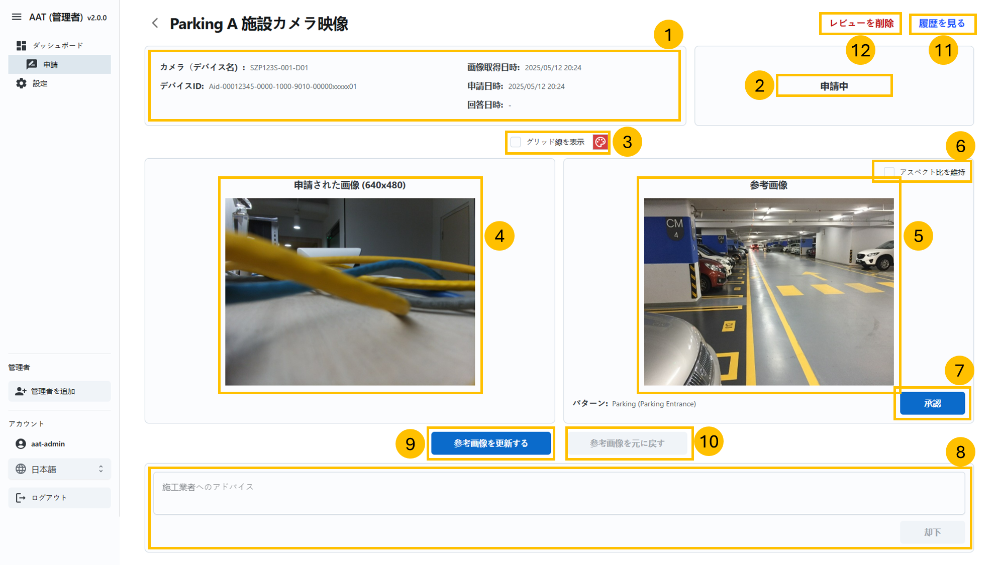

= AAT管理者アプリユーザーガイド
:docinfo: shared
:doctype: book
:data-uri:
:title: Angle Adjustment Tool (AAT) - Admin App User Guide
:revdate: 2025 - 02 - 27
:revnumber: 1.7.0
:toc: left
:toclevels: 3
:toc-title: Table of Contents
:sectanchors:
:sectlinks:
:sectnums:
:multipage-level: 2
:icons: font
:encoding: utf-8

== 推奨環境と使用上の注意

管理者アプリの推奨環境

=== 操作環境の確認

* OS: Windows
* ブラウザ: Chrome

=== 推奨ディスプレイ設定

* ディスプレイ設定
  ** 解像度: 1920 x 1080
  ** 倍率: 100 %

* ブラウザ
  ** 倍率: 100 %

== ワークフロー

以下の図は管理者アプリの典型的なワークフローについて説明しています:

.管理者アプリのワークフロー
image::./admin-app-images-ja/admin_workflow.png[Admin App Workflow <1>]

1. **ログイン:** 管理者ユーザーはログイン認証情報を使用してアプリケーションにログインすることから始めます。
2. **ダッシュボード:** ログイン後、管理者は申請を閲覧・フィルターできるダッシュボードへと移動します。
  * **申請:** 管理者は申請を承認・却下する申請ページへ移動します。
    - **申請履歴:** 管理者は選択されたデバイスの申請履歴を見ることができます。
3. **コンソールの設定:** 管理者はカスタマーのコンソール認証情報を設定できます。
  * **設定の編集:** 管理者はカスタマーのコンソール認証情報を閲覧・更新できます。

== ログイン

管理者アプリへのアクセスにはURLが必要です。URLはクラウド・システム管理者より入手できます。
URLを入手したら、Webブラウザ上で開いてください。

.管理者ログイン
image::./admin-app-images-ja/admin_login.png[Admin Login Page <2>]

AAT管理者ポータルにログインするには、有効な `ログインID` と `パスワード` を入力し、 `ログイン` をクリックします

* **ログインID:** ログインIDはクラウド・システム管理者より提供されます。
* **パスワード:** パスワードは、クラウド・システム管理者より提供されるパスワードです。

== ダッシュボード

 **ダッシュボード** ページはログイン後に表示され、デバイスのアプリケーションリストが含まれています。

.ダッシュボードリストビュー

.ダッシュボードタイルビュー

1. **名前とバージョン:** アプリケーションの名前と現在のバージョンです (AAT: 画角調整ツール)。
2. **サイドバーオプション:** ナビゲーションはダッシュボード・コンソール設定にリンクしています。
3. **言語トグル:** ドロップダウンからアプリケーションの言語を変更します
4. **アカウント名:** 管理者のログインID
5. **ログアウトボタン:** `ログアウト` をクリックしてアカウントからログアウトします。
6. **フィルター:** フィルターを使用して、申請リストから検索します。管理者は以下の要素に基づいてアプリケーションをフィルターします。:
  . `顧客名`
  * フィルター方法: ドロップダウンリスト (１つのみ選択可)
  * 説明: 選択した顧客名で検索をします
  * 使い方: ドロップダウンより顧客名を選択してください

  . `都道府県`
  * フィルター方法: ドロップダウンリスト (複数選択可)
  * 説明: 選択した都道府県名で検索します
  * 使い方: ドロップダウンリストにある都道府県名にチェックを入れてください

  . `市区町村`
  * フィルター方法: テキストボックス（部分入力可）
  * 説明: 入力したキーワードを含む市区町村名で検索します
  * 使い方: 検索したい市区町村名を全て、または一部だけ入力してください

  . `施設名から探す`
  * フィルター方法: テキストボックス（部分入力可）
  * 説明: 入力したキーワードを含む施設名で検索します
  * 使い方: 検索したい施設名を全て、または一部だけ入力してください
  * 例:
  ** 施設として"Car Parking Lot"と"Bike Parking Lot"がある場合、
  ** "Car"を入力した時"Car Parking Lot"の施設が表示されます
  ** "Bike"を入力した時 "Bike Parking Lot"の施設が表示されます
  ** "Parking"を入力した時"Car Parking Lot" と "Bike Parking Lot"の施設が表示されます
  ** "Lot Parking"を入力した時 "Car Parking Lot" と "Bike Parking Lot"の施設が表示されます

[注記]
====
* 検索ボタン: 検索ボタンを使用することで、指定された条件 (カスタマー名、都道府県、市区町村、施設名)に基づいてフィルタを適用します。このアクションにより、入力されたフィルターの項目に一致する申請が表示されます。また、最新結果を取得するためのリロードボタンの代わりとしても機能します。
* クリアボタン: クリアボタンをクリックすると、適用されたフィルターがすべてリセットされ、デフォルトのフィルターなしですべての申請が表示されます。
====

[arabic, start=7]
1. **アプリケーションステータスのチェックボックス:** ステータスに基づいてアプリケーション一覧を表示するチェックボックスを選択します。
2. **詳細ボタン:** `詳細` をクリックし、特定のデバイスの最新の申請詳細を閲覧します。
3. **デバイスの接続状態:** `デバイスID` 欄のデバイスIDの左側はデバイスの接続状態を示しています。
  * 緑色の〇印: AITRIOSに接続済み
  * 赤色の×印: AITRIOSに接続されていない、もしくは ステータス不明
4. **リストビュー/タイルビュー:** ダッシュボードの表示方法は2種類あります。
  * リストビュー: 申請の一覧が行形式で表示されます。
  * タイルビュー:申請の一覧が申請されたカメラ画像のプレビューを含む欄形式で表示されます。プレビューのサイズは3種類から選べます:
    ** 小: 小サイズのサムネイルで多数のアイテムが表示されます。
    ** 中: 中サイズのサムネイルでアイテムが表示されます。
    ** 大: 大サイズのサムネイルで少数のアイテムが表示されます。

=== 申請ページ

.申請の詳細

.グリッド線のカラーピッカー
image::./admin-app-images-ja/grid_line_color_picker.png[Grid Line Color Picker <6>]

1. **デバイスと申請の詳細:** 申請中のデバイスについての詳細を表示します。
2. **アプリケーションのステータス:** 現在のアプリケーションのステータスを表示します。
3. **画像のグリッド線:** ［グリッド線を表示］のチェックボックスをオンにすると、送信済みの画像、および参考画像にグリッド線が表示されます。チェックボックスの横のパレットボタンをクリックするとカラーピッカーが開き、グリッド線の色を変更できます。
4. **申請された画像:** コントラクターが確認用に提出した画像です。
5. **参考画像:** 申請中に提出した画像と比較するための参考画像です。
6. **アスペクト比の保持:** 有効にすると、参考イメージの元の寸法が保持されます。 無効にすると、参考イメージは送信したイメージの寸法に合うようリサイズされるため、結果的に画像が歪んだり、引き伸ばされたりする可能性があります。
7. **承認ボタン:** 確認後 `承認` をクリックして申請リクエストを承認します。
8. **却下ボタン:**  却下の理由をフィールド内に記載したら、 `却下` をクリックして申請リスエストを却下します。
9. **参考イメージの更新ボタン:** `参考イメージの更新` をクリックすると、ポップアップウィンドウが開き、送信済みのイメージをドラッグして調整し、新しい参考イメージとして保存することができます。
10. **参考イメージの復元ボタン:** `参考イメージの復元` をクリックすると、すべての変更が破棄され、最後に保存した参考イメージにリセットされます。
11. **履歴の閲覧:** `履歴の閲覧` をクリックすると、選択されたデバイスの申請データの履歴が閲覧できます。

==== 送信済みイメージを調整し、参考イメージとして保存

ユーザーは送信済みのイメージを調整して参考イメージとして保存することで、承認を却下することができます。

.送信済みイメージを調整し
image::./admin-app-images-ja/adjust_submitted_image.png[Adjust Submitted Image <7>]

* このインターフェースにより、参考イメージとして保存する前にユーザーは送信済みのイメージをドラッグ・調整することができます。
* このウィンドウではグリッド線が表示され、微調整ができるようになります。
* 送信済みのイメージにユーザーが調整を加えたら、 `参考イメージの更新` ボタンをクリックすると、調整後の画像が新しい参考イメージとしてプレビュー表示されます。
* 却下コメントのフィールドが空の場合、参考イメージを更新する際にデフォルトのコメントがテキストエリアに自動的に追加されます。 ユーザーは却下する前に必要に応じてこのコメントを修正することができます。

[注記]
====
* 参考イメージを更新すると、申請を承認するオプションが無効になります。 これは、送信されたイメージが更新された参考イメージに合致した時点で、ユーザーが申請を承認できるようにするためです。
* 申請が却下された場合、更新された参考イメージは既存の参考イメージに恒久的に上書きされます。 つまり、以前の参考イメージは使用できなくなります。
====

.更新された参考イメージ
image::./admin-app-images-ja/updated_reference_image.png[Updated Reference Image <8>]

* ユーザーが調整をの破棄を選択すると、参考イメージを最後に保存したバージョンにリセットすることができます。
* 申請が却下されると、更新された参考イメージは恒久的に保存され、以前の参考イメージと置き換えられます。

==== 申請履歴

選択されたデバイスのすべての申請がここに表示されます。

.申請履歴
image::./admin-app-images-ja/review_history_main.png[Review History <9>]

* **申請画像:** サムネイルをクリックすると各申請画像のプレビューが大きく表示されます。
* **申請コメント:** 申請に対するコメントです（ある場合）

.申請画像のプレビュー
image::./admin-app-images-ja/review_history_image_preview.png[Review Image Preview <10>]

== コンソール設定

コンソール設定ページには、管理者アカウントにログインしたカスタマーの一覧が表示されます。
このページには、選択されたカスタマーのコンソール認証情報を編集するオプションがあります。

.設定リスト
image::./admin-app-images-ja/configuration_list.png[Configuration List <11>]

1. **編集ボタン:** `編集` をクリックし、選択されたカスタマーのコンソール認証情報を変更します。

=== コンソール設定の編集

管理者は選択されたカスタマーのコンソール認証情報を閲覧・編集できます。

.設定の編集
image::./admin-app-images-ja/edit_configuration.png[Edit Configuration <12>]

認証情報を変更する場合、その旨編集して保存をクリックします。

== よくある質問

よくある質問とその回答は以下の通りです。

Q: 申請履歴はどのように閲覧できますか?::
A: 申請ページへ移動し、 `履歴の閲覧` をクリックします。

Q: 管理者アプリのログイン認証情報はどうやって取得できますか?::
A: ログイン認証情報に関してはシステム/クラウド管理者にお問い合わせください。

Q: 管理者アプリのパスワードはどうやってリセットできますか?::
A: パスワードのリセットのリクエストに関しては、システム/クラウド管理者にお問い合わせください。

Q: カスタマーのコンソール認証情報はどうやって取得できますか?::
A: カスタマーのコンソール認証情報の取得に関しては、システム/クラウド管理者に問い合わせるか、 AITRIOSデベロッパーサイトマニュアルを参照してください。
