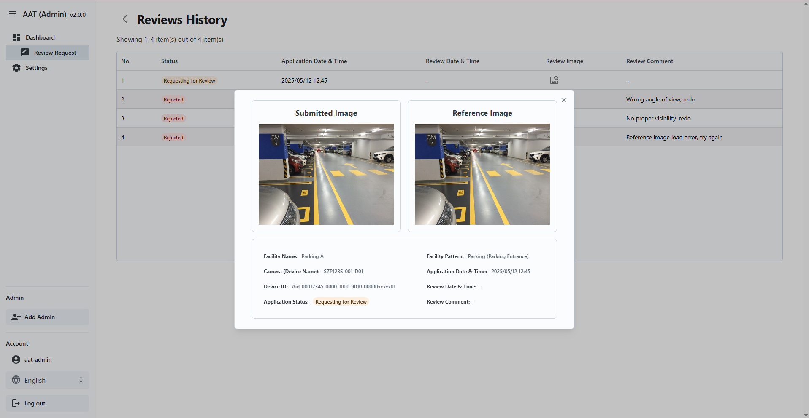

= AAT Admin App User Guide
:docinfo: shared
:doctype: book
:data-uri:
:title: Angle Adjustment Tool (AAT) - Admin App User Guide
:revdate: 2024 - 07 - 02
:revnumber: 1.0.0-RC
:toc: left
:toclevels: 3
:toc-title: Table of Contents
:sectanchors:
:sectlinks:
:sectnums:
:multipage-level: 2
:icons: font
:encoding: utf-8

== Recommended environment and usage notes

Recommended environment for Admin App.

=== Verified operating environment

* OS: Windows
* Browser: Chrome

=== Recommended display settings

* Display settings
  ** Resolution: 1920 x 1080
  ** Magnification: 100 %

* Browser
  ** Magnification: 100 %

== Workflow

The following diagram illustrates the typical workflow of the Admin App:

.Admin App Workflow
image::./admin-app-images/admin_workflow.png[Admin App Workflow <1>]

1. **Login:** Admin users start by logging into the application using their login credentials.
2. **Dashboard:** Post-login, Admin is directed to the Dashboard where admin can view and filter applications.
  * **Review:** Admin can navigate to the Review page to approve or reject applications.
    - **Review History:** Admin can view history of reviews for a selected device.
3. **Console Configuration:** Admin can configure console credentials for customers.
  * **Edit Configuration:** Admin can view/update customer's console credentials.

== Login

To access the Admin app, URL is required. The URL can be obtained from the cloud/system administrator.
Once URL is obtained, open in web browser.

.Admin Login
image::./admin-app-images/admin_login.png[Admin Login Page <2>]

To log in to AAT Admin Portal, please enter valid `Login ID` and `Password` then click `Login`.

* **Login ID:** Login ID shall be provided by the cloud/system administrator.
* **Password:** Password shall be password provided by the cloud/system administrator.

== Dashboard

The **Dashboard** page is displayed after logging in. It contains the application list for the devices.

.Dashboard
image::./admin-app-images/application_list.png[Admin Dashboard Page <3>]

1. **Name and Version:** The application's name and current version (AAT: Angle Adjustment Tool).
2. **Sidebar options:** Navigation links to Dashboard & Console Configuration.
3. **Language Toggle:** A dropdown to change the application's language.
4. **Account Name:** The Login ID of the Admin.
5. **Logout Button:** Click `Log out` to log out of the account.
6. **Filter:** Use the filter to search for the device application list. Admin can filter applications based on:
  . `Customer Name`
  * Filter type: Dropdown (Single Selection)
  * Description: This filter allows to search application list by customer name.
  * How to use: Select any customer from the dropdown.

  . `State/Province/Region`
  * Filter type: Dropdown (Multiple Selection)
  * Description: This filter allows to search application list by State/Province/Region.
  * How to use: Select one or more State/Province/Region from the dropdown list.

  . `City/Town`
  * Filter type: Text Box (Full or partial word search)
  * Description: This filter allows to search application list by City/Town name.
  * How to use: Enter keyword containing full or partial name of the City/Town.

  . `Search by Facility name`
  * Filter type: Text Box (Full or partial word search)
  * Description: This filter allows to search application list by facility name.
  * How to use: Enter keyword containing full or partial name of the facility name.
  * Example:
  ** If there are 2 facilities: "Car Parking Lot" and "Bike Parking Lot"
  ** Searching for "Car" returns "Car Parking Lot"
  ** Searching for "Bike" returns "Bike Parking Lot"
  ** Searching for "Parking" returns both "Car Parking Lot" and "Bike Parking Lot"
  ** Searching for "Lot Parking" returns both "Car Parking Lot" and "Bike Parking Lot"

[NOTE]
====
* Search Button: Use the Search button to apply filters based on the specified criteria (Customer Name, State/Province/Region, City/Town, Facility Name). This action retrieves device applications that match the entered filter parameters. Additionally, it can be used as a reload button to fetch the latest results.
* Clear Button: Use the Clear button to reset all applied filters and return to the default view of all device applications without any filtering criteria.
====

[arabic, start=7]
1. **Application Status Checkboxes:** Select the checkboxes to display application list based on their status.
2. **Details Button:** Click `Details` to view the latest review details of a specific device.
3. **Device Connection State:** Device connection is indicated left to the Device ID in the `Device ID` column.
  * Green dot: Device is connected to AITRIOS
  * Red dot: Device is disconnected from AITRIOS
  * Grey dot: Device connection state unknown

=== Review Page

.Review Details
image::./admin-app-images/review_details.png[Review Details <4>]

1. **Device and Review Details:** Displays details about the device under review.
2. **Application Status:** Displays the current application status.
3. **Submitted Image:** Image submitted by the contractor for verification.
4. **Reference Image:** Reference image to compare against the submitted image during review.
5. **Approve Button:** Click `Approve` to approve the review request after verification.
6. **Reject Button:** Enter the rejection reason in the provided field, then click `Reject` to reject the review request.
7. **View History:** Click `View History` to see the history of review data for the selected device.

==== Review History

All the reviews of the selected device are listed here.

.Review History
image::./admin-app-images/review_history_main.png[Review History <5>]

* **Review Image:** Click thumbnail to view larger previews of images associated with each review.
* **Review Comment:** Review comment if any.

.Review Image Preview

== Console Configuration

Console configuration page displays the list of customers for the logged in Admin account.
The page has an option to edit the console credentials for the selected Customer.

.Configuration List
image::./admin-app-images/configuration_list.png[Configuration List <7>]

1. **Edit Button:** Click `Edit` to modify the console credentials for a selected customer.

=== Edit Console Configuration

Admin can view/edit console credentials of the selected customer.

.Edit Configuration
image::./admin-app-images/edit_configuration.png[Edit Configuration <8>]

To change the credentials, please edit as applicable and click Save.

== FAQs

Here are some frequently asked questions and their answers.

Q: How can I view the review history?::
A: Navigate to the Review Page and click `View History`.

Q: How do I get login credentials of Admin App?::
A: Check with system/cloud Administrator to know the login credentials.

Q: How do I reset password of Admin App?::
A: Check with system/cloud Administrator to request to reset the password.

Q: How do I get Customer Console Credentials?::
A: Check with system/cloud Administrator to get customer's console credentials or refer AITRIOS developer site documentation.
