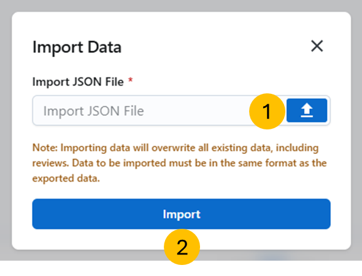
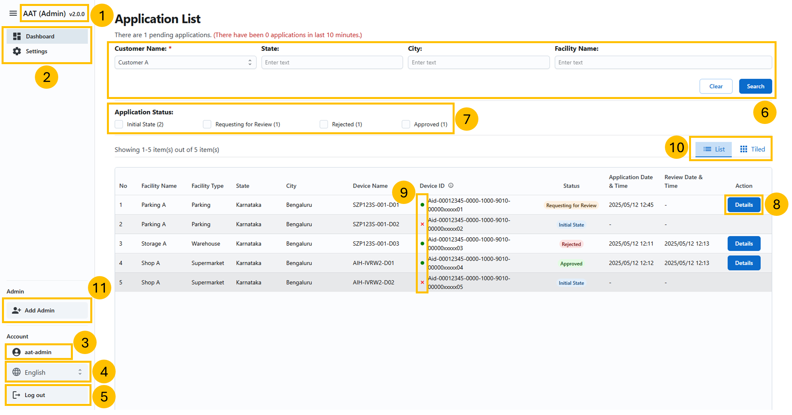
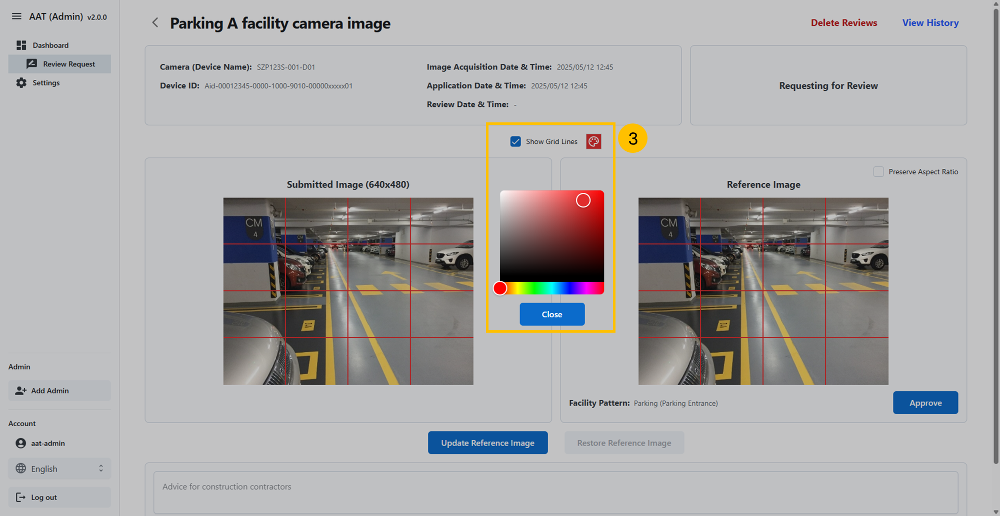
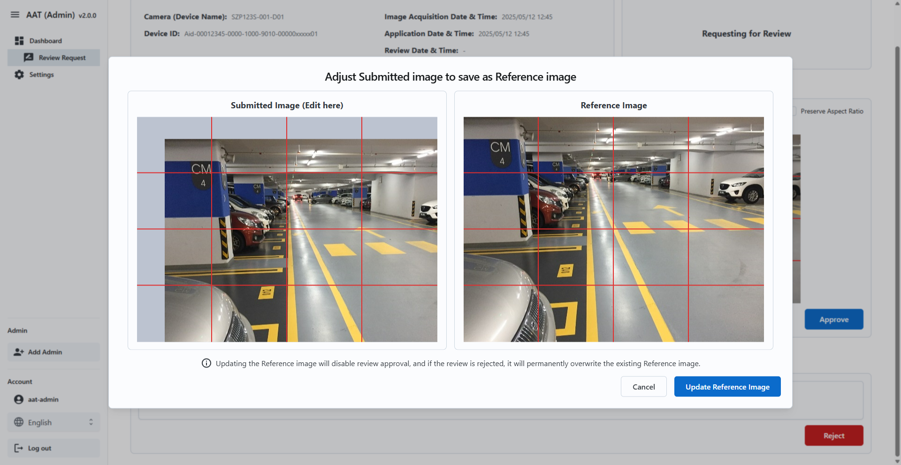
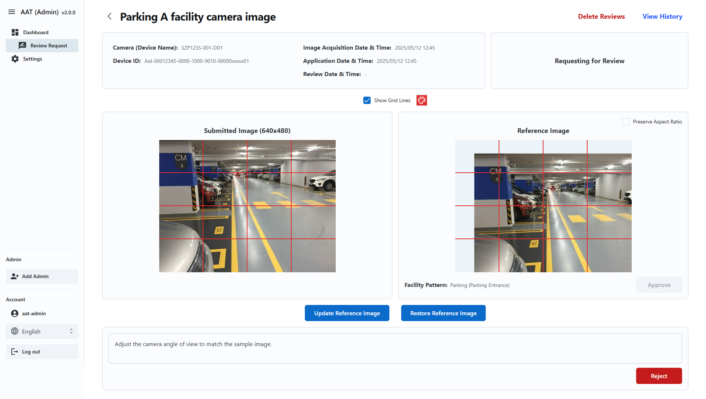

= AAT Admin App User Guide
:docinfo: shared
:doctype: book
:data-uri:
:title: Angle Adjustment Tool (AAT) - Admin App User Guide
:revdate: 2025 - 05 - 19
:revnumber: 2.0.0
:toc: left
:toclevels: 3
:toc-title: Table of Contents
:sectanchors:
:sectlinks:
:sectnums:
:multipage-level: 2
:icons: font
:encoding: utf-8

== Recommended environment and usage notes

Recommended environment for Admin App.

=== Verified operating environment

* OS: Windows
* Browser: Chrome

=== Recommended display settings

* Display settings
  ** Resolution: 1920 x 1080
  ** Magnification: 100 %

* Browser
  ** Magnification: 100 %

== Workflow

The following diagram illustrates the typical workflow of the Admin App:

.Admin App Workflow
image::./admin-app-images/admin_workflow.png[Admin App Workflow <1>]

1. **Login:** Admin users start by logging into the application using their login credentials.
2. **Dashboard:** Post-login, Admin is directed to the Dashboard where admin can view and filter applications.
  * **Add Admin:** Admin can create a new admin user.
  * **Review Applications**
   - Navigate to the Review page to approve or reject applications.
   - Compare submitted images with reference images.
   - Adjust submitted images if needed and save them as new reference images.
3. **Settings:** Admin can manage customer data and devices.
   - **Add/Edit Customers:** Create or update customer credentials.
   - **Generate QR Codes:** Create QR codes for facilities.
   - **Manage Devices:** Add or remove devices for a customer and assign facilities and device types to each device.
   - **Import/Export Data:** Upload or download customer and device data in JSON format.

== Login

To access the Admin app, URL is required. The URL can be obtained from the cloud/system administrator.
Once URL is obtained, open in web browser.

.Admin Login
image::./admin-app-images/admin_login.png[Admin Login Page <2>]

To log in to AAT Admin Portal, please enter valid `Login ID` and `Password` then click `Login`.

* **Login ID:** Login ID shall be provided by the cloud/system administrator.
* **Password:** Password shall be password provided by the cloud/system administrator.

== Quick Database Population

* This section allows Admin to quickly populate the database with all the data.
* Customers, facilities, facility types, device types and their respective reference images can be added.
* Devices are fetched from the AITRIOS project which is associated with the customer credentials.
* Device connection status helps in deciding whether the device is to be registered in AAT or not.

=== Settings
* This section allows Admin to manage the customer credentials and devices.
* Admin can add/edit customer credentials and manage devices for the selected customer.
* Admin can generate QR codes for the selected customer.
* Admin can import/export data of customers, devices, facilities, facility types and device types.

==== Customer List Initial State

.Empty Customer List

1. Admin can click `Add Customer` to add a new customer.
2. Admin can click `Import Data` to import the data of customers, devices, facilities, facility types and device types.

===== Add Customer

.Add Customer

1. **Customer Details:** Fill out the customer details in the form.
  * **Customer Name:** Enter the name of the customer.
  * **Client ID:** Client ID from the AITRIOS Portal.
  * **Client Secret:** Client Secret from the AITRIOS Portal.
  * **Auth URL:** Enter the authentication URL.
  * **Console Endpoint:** Enter the console endpoint.
  * **Application ID:** Enter the application ID.

2. **Next:** This will verify the customer credentials and proceed to the 'Manage Devices' page.
3. **Reset:** This will reset the values entered so far.

To change the credentials, please edit as applicable and click Save.

==== Customer List Populated

.Customer List

1. **Edit:** This option allows admin to edit the customer credentials. Admin can click `Edit` to edit the customer credentials.
2. **Manage Devices:** This option allows admin to manage devices for the selected customer.
3. **Generate QR:** This option allows admin to generate QR codes for the selected customer.
4. **Export Data:** With this option, Admin can export the data which includes the devices, facilities of all the devices, facility types, device types and their respective reference images associated with the admins and customers. However, review history of the devices is not included in the export data.
5. **Import Data:** This feature allows admin to import data of devices, facilities, facility types and device types. However, this option overwrites the existing data in the database. Please make sure to take a backup of the data before importing.

=== Manage Devices

* This section allows admin to manage devices for the selected customer. Admin can select the devices and assign them to a facility and device type.

.Manage Devices

1. **Customer List:** This drop down allows admin to select the customer for whom the devices are being managed. The list is populated with customers added in the previous step.
2. **Device Selection:** This checkbox allows admin to select the devices to be registered. Selected devices can be edited in batches for Facility and DeviceType. Registered and unregistered devices can be deleted. Also, connection status is shown for each device which helps in identifying the devices that are connected to AITRIOS.
3. **Find or Create Facility:** This option allows admin to create/to select the Facility for the selected devices.
4. **Find or Create Device Types:** This option allows admin to create/to select the Device Type for selected devices.
5. **Register/Update Selected Devices:** Every device needs to be associated with a facility and device type. Admin can select the devices and click `Register/Update Selected Devices` to register or update the selected devices.
6. **Batch Edit Selected Devices:** With this option, Admin can set the facility and device type for multiple devices at once. Admin can select the devices and click `Batch Edit Selected Devices` to set the facility and device type.
7. **Deregister Selected Devices:** This option allows admin to deregister the selected devices. Admin can select the devices and click `Deregister Selected Devices` to deregister the selected devices.
8. **Refresh Devices List:** Devices can be refreshed by clicking `Refresh Devices List` button. This will refresh the list of devices and show the latest status.

==== Add Facility and Facility Type

* This option allows admin to create a new Facility and Facility type.

.Add Facility

.Add Facility Type

1. **Facility Name:** Here, admin can enter the name of the facility.
2. **Facility Type:** Create or select the facility type from the dropdown.
  2.1 **Facility Type Name:** This option allows admin to create a new facility type. Admin can enter the name of the facility type and click `Add Facility Type` to add the facility type.
3. **State:** This option allows admin to select the State for the facility.
4. **City:** This option allows admin to select the City for the facility.
5. **Effective Start Date:** This is the date when the facility QR Code will be effective. Admin can select the date from the widget.
6. **Effective End Date:** This is the date when the facility QR Code will expire. Admin can select the date from the widget.
7. **Create Facility:** This button allows admin to create the facility. Admin can click `Create Facility` to create the facility.

==== Add Device Type

* This option allows admin to create a new device type.

.Add Device Type

1. **Device Type Name:** Admin can enter the name of the device type.
2. **Reference Image:** This option allows admin to upload a reference image for the device type. Admin can click `Upload` button to upload the reference image.
3. **Add:** This button allows admin to add the device type.

=== Generate QR

* QR Codes are used to launch the Contractor App. It contains the Contractor App URL integrated with the Facility details. Once QR code is scanned, it will open the Contractor App with the particular Facility details and displays the list of the Devices which need to be setup.
* This section allows admin to generate QR codes for the selected Facilities or all facilities from a particular Customer. Admin can select the devices and click `Generate QR` to generate the QR codes.

.Generate QR

1. **Customer Name:** This option allows admin to select the customer for whom the QR codes are to be generated.
2. **Facility Name:** This option allows admin to select the facility for which the QR codes are to be generated.
3. **Generate & Download:** This button allows admin to generate the QR codes for the selected facilities. If no facility is selected for a particular customer, QR Codes will be generated for all the facilities belonging to that customer. A single zip file will be downloaded for selected options separated by Customer and Facility.

=== Export Data

* Admin can export the data which includes the devices, facilities of all the devices, facility types, device types and their respective reference images associated with the admins and customers. However, because of the size constraint, the angle adjustment reviews of the devices are not included in the export data.
* This section allows admin to export the data for the logged in admin. Admin can click `Export Data` to export the data.

.Export Data

* A json file with the name format **AAT_Data_ADMIN-NAME-HERE_YYYYMMDDHHMMSS.json** will be downloaded automatically with the data.
  * **ADMIN-NAME-HERE** is the name of the logged in admin.
  * **YYYYMMDDHHMMSS** is the date and time when the data was exported.
  * E.g. `AAT_Data_aat-admin_20250423094029.json`

=== Import Data

* Admin can import the data which includes the devices, facilities of all the devices, facility types, device types and their respective reference images associated with the admins and customers. However, similar to the export data feature, the angle adjustment reviews of the devices are not included in the import data.
* This section allows admin to import the data for the logged in admin.
* Admin can import the data from a json file. The json file should be in the same format as the exported data.

WARNING: Importing data into the database will overwrite the existing data. Please make sure to take a backup of the data before importing.

.Import Data

1. **Upload:** Admin can click Upload button to upload the JSON file.
2. **Import:** Imports the data from the selected json file. Admin can click `Import` button to import the data.

== Dashboard

The **Dashboard** page is displayed after logging in. It contains the application list for the devices.

.Dashboard Listview

.Dashboard Tiledview
image::./admin-app-images/dashboard_tiled.png[Admin Dashboard Tiled <14>]

1. **Name and Version:** The application's name and current version (AAT: Angle Adjustment Tool).
2. **Sidebar options:** Navigation links to Dashboard & Console Configuration.
3. **Language Toggle:** A dropdown to change the application's language.
4. **Account Name:** The Login ID of the Admin.
5. **Logout Button:** Click `Log out` to log out of the account.
6. **Filter:** Use the filter to search for the device application list. Admin can filter applications based on:
  . `Customer Name`
  * Filter type: Dropdown (Single Selection)
  * Description: This filter allows to search application list by customer name.
  * How to use: Select any customer from the dropdown.

  . `State`
  * Filter type: Text Box (Full or partial word search)
  * Description: This filter allows to search application list by State name.
  * How to use: Enter keyword containing full or partial name of the State.

  . `City`
  * Filter type: Text Box (Full or partial word search)
  * Description: This filter allows to search application list by City name.
  * How to use: Enter keyword containing full or partial name of the City.

  . `Search by Facility name`
  * Filter type: Text Box (Full or partial word search)
  * Description: This filter allows to search application list by facility name.
  * How to use: Enter keyword containing full or partial name of the facility name.
  * Example:
  ** If there are 2 facilities: "Car Parking Lot" and "Bike Parking Lot"
  ** Searching for "Car" returns "Car Parking Lot"
  ** Searching for "Bike" returns "Bike Parking Lot"
  ** Searching for "Parking" returns both "Car Parking Lot" and "Bike Parking Lot"
  ** Searching for "Lot Parking" returns both "Car Parking Lot" and "Bike Parking Lot"

[NOTE]
====
* Search Button: Use the Search button to apply filters based on the specified criteria (Customer Name, State, City, Facility Name). This action retrieves device applications that match the entered filter parameters. Additionally, it can be used as a reload button to fetch the latest results.
* Clear Button: Use the Clear button to reset all applied filters and return to the default view of all device applications without any filtering criteria.
====

[arabic, start=7]
1. **Application Status Checkboxes:** Select the checkboxes to display application list based on their status.
2. **Details Button:** Click `Details` to view the latest review details of a specific device.
3. **Device Connection State:** Device connection is indicated left to the Device ID in the `Device ID` column.
  * Green dot: Device is connected to AITRIOS.
  * Red cross: Device is disconnected from AITRIOS or state is unknown.
4. **List/Tiled view:** Dashboard has 2 viewing options.
  * List View: The list view presents application list in row-by-row format.
  * Tiled View: The tiled View arranges application list in columns, providing preview of submitted camera image. The preview size varies based on the selected tile size:
    ** Small: Shows more items with smaller thumbnails.
    ** Medium: Balances the number of items with thumbnail size.
    ** Large: Shows fewer items with larger thumbnails.
5. **Add Admin:** Click `Add Admin` to create a new admin user.

=== Add Admin
* This section allows Admin to create a new Admin user.

.Add Admin

* Admin can create a new admin user by entering the `Login ID` and `Password` in the form.
* Admin can click `Create Admin` to create the new admin user.

.New Admin Created

* Admin can copy the credentials of new admin for sharing, which are visible only once.

=== Review Page

.Review Details

.Grid Line Color Picker

1. **Device and Review Details:** Displays details about the device under review.
2. **Application Status:** Displays the current application status.
3. **Image Grid Lines:** The `Show Grid Lines` checkbox allows user to toggle the visibility of grid lines on the submitted and reference image. The palette button next to grid line checkbox opens a color picker to customize the grid line color.
4. **Submitted Image:** Image submitted by the contractor for verification.
5. **Reference Image:** Reference image to compare against the submitted image during review.
6. **Preserve Aspect Ratio:** When enabled, the reference image maintains its original dimensions. If disabled, the reference image will be resized to match the dimensions of the submitted image, which may result in distortion or stretching of the image.
7. **Approve Button:** Click `Approve` to approve the review request after verification.
8. **Reject Button:** Enter the rejection reason in the provided field, then click `Reject` to reject the review request.
9. **Update Reference Image Button:** Click `Update Reference Image` to open a pop-up window where user can drag and adjust the submitted image, then save it as the new reference image.
10. **Restore Reference Image Button:** Click `Restore Reference Image` to reset the reference image to the last saved version, discarding any changes made.
11. **View History:** Click `View History` to see the history of review data for the device.
12. **Delete Reviews:** Click `Delete Reviews` to delete the review data for the device. This action will remove all review history associated with the device.

==== Adjust Submitted image to save as Reference image

Users can reject the review by making adjustments to submitted image and saving it as the reference image.

.Adjust Submitted Image

* This interface allows users to drag and adjust the submitted image before saving it as the reference image.
* Grid lines are enabled in this window to assist with precise adjustments.
* Once the user has made the desired adjustments to the submitted image, clicking the `Update Reference Image` button will provide the preview of the adjusted image as the new reference image.
* If the reject comment field is empty, a default comment will be automatically added to the text area when updating the reference image. The user can then modify this comment as needed before rejecting.

[NOTE]
====
* Updating the reference image will disable the option to approve the review. This is to ensure that the user can approve the review once submitted image aligns with the updated reference image.
* If the review is rejected, the updated reference image will permanently overwrite the existing reference image. This means that the previous reference image will no longer be available.
====

.Updated Reference Image

* The user can reset the reference image to the last saved version if they choose to discard the adjustments.
* On rejecting the review, the updated reference image will be permanently saved, replacing the previous reference image.

==== Review History

All the reviews of the selected device are listed here.

.Review History
image::./admin-app-images/review_history_main.png[Review History <21>]

* **Review Image:** Click thumbnail to view larger previews of images associated with each review.
* **Review Comment:** Review comment if any.

.Review Image Preview
image::./admin-app-images/review_history_image_preview.png[Review Image Preview <22>]

== FAQs

Here are some frequently asked questions and their answers.

Q: How can I view the review history?::
A: Navigate to the Review Page and click `View History`.

Q: How do I get login credentials of Admin App?::
A: Check with system/cloud Administrator to know the login credentials.

Q: How do I reset password of Admin App?::
A: Check with system/cloud Administrator to request to reset the password.

Q: How do I get Customer Console Credentials?::
A: Check with system/cloud Administrator to get customer's console credentials or refer AITRIOS developer site documentation.
