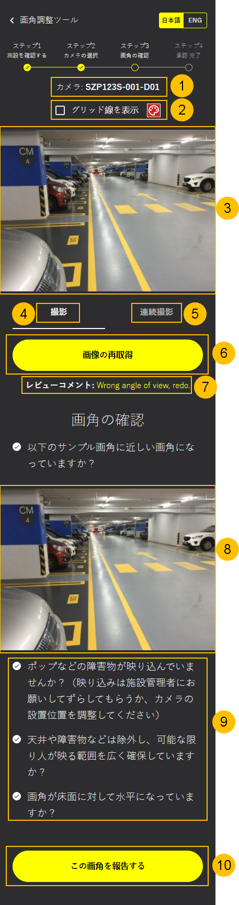
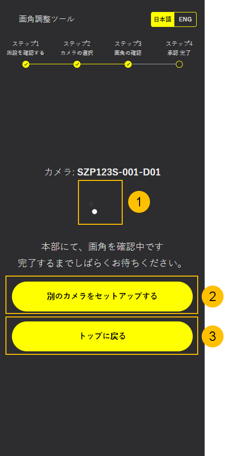
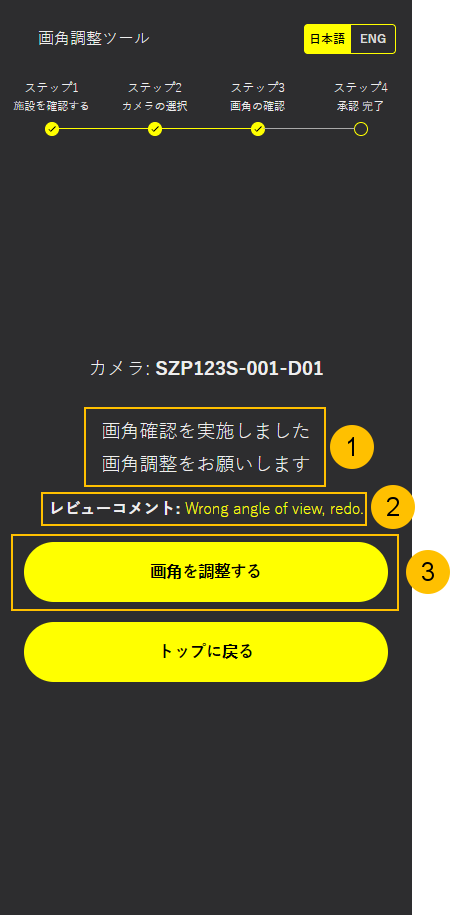

= AATコントラクターアプリ ユーザガイド
:docinfo: shared
:doctype: book
:data-uri:
:title: Angle Adjustment Tool (AAT) - Contractor App User Guide
:revdate: 2025 - 02 - 27
:revnumber: 1.7.0
:toc: left
:toclevels: 3
:toc-title: Table of Contents
:sectanchors:
:sectlinks:
:sectnums:
:multipage-level: 2
:icons: font
:encoding: utf-8

== 推奨環境と使用上の注意

コントラクターアプリの推奨環境

=== 操作環境の確認

* OS: Android / iOS
* ブラウザ: Chrome / Safari

=== 推奨ディスプレイ設定

* ディスプレイ設定
  ** 解像度: 1080 x 2400
  ** 倍率: 100 %

* ブラウザ
  ** 倍率: 100 %

* フォントサイズ
  ** ブラウザのフォントサイズはデフォルト設定を推奨します。

== ワークフロー
以下の図はコントラクターアプリの典型的なワークフローについて説明しています:

.コントラクターアプリのワークフロー

1. **QRのスキャン:** 携帯電話でコントラクターアプリのQRコードをスキャンします。
2. **施設の確認:** 表示された施設の詳細から施設を確認します。
3. **カメラの一覧:** 一覧から設置するカメラを選択します。
4. **カメラ角度のキャプチャ:** カメラ画像をキャプチャし、画角を確認して角度を申請します。
5. **承認待ち:** 管理者が申請した画角を承認するまで待ちます。
6. **申請の承認:** 申請した画角が承認されたら、他のカメラの設置へ進みます。
7. **申請の却下:** 申請した画角が却下された場合はもう一度カメラの設置をします。

== アプリの開き方

コントラクターアプリのQRコードがボックス内に収まるようにスキャンします。

[注記]
====
管理者に連絡してQRコードを取得します。
====

.コントラクターアプリのQRコード
image::./contractor-app-images-ja/app_url.png[Contractor App QR Code <2>, width=250]

携帯のカメラアプリで検出されたリンクをクリックし、コントラクターアプリにアクセスします。これにより携帯のデフォルトブラウザでコントラクターアプリが開きます。

1. **コントラクターアプリQRコード:** 携帯電話で枠内に表示されたコントラクターアプリのQRコードをスキャンします。
2. **コントラクターアプリURL:** コントラクターアプリURLはQRコードの下に表示されます。クリックしてコントラクターアプリを開いてください。

== アプリの操作方法

QRコードが正しい場合、施設詳細が表示されます。施設を確認して次に進みます。

=== 施設の確認

.施設の確認ページ
image::./contractor-app-images-ja/facility_confirm.png[Facility Confirmation Page <3>, width=150]

1. **言語変更:** アプリで使用する言語を選択してください。デフォルトは日本語になっています。
2. **プログレスバー:** プログレスバーには現在進行中の手順が表示され、完了したステップはチェックで表示されています。
3. **施設の詳細:** 施設の詳細には確認用の施設名、都道府県、市区町村などが含まれます。
4. **施設の確認:** 施設の確認ボタンが使用して、上記に記載されている施設の詳細を確認します。
5. **アプリのバージョン:** アプリケーションのバージョンが表示されます。

=== カメラの一覧

.カメラの一覧

1. **施設名:** 施設名が表示されます。
2. **更新:** カメラの一覧を手動で更新するときは更新ボタンを使用します。
3. **ステータスフィルタ:** 以下3つのカテゴリーがあります。:
+
--
1. To Do - 現在設置待ちのすべてのカメラの一覧
2. 申請中 - 現在管理者へ申請中のすべてのカメラの一覧
3. 設置完了 - 既に設置されたすべてのカメラの一覧
--

4. **カメラ:** 各カメラの一覧には名前、ステータス、設置ボタンがあります。
5. **ステータス:** カメラの設置状況を表示します。
6. **カメラ接続ステータス:** カメラの接続ステータス
  * 緑色の〇印: カメラはオンライン
  * 赤色の×印: カメラはオフライン
7. **設置:** 一覧の各カメラには *設置* ボタンがあり、 *To Do* ステータスのカメラでのみ有効です。

*設置* ボタンをクリックしてカメラの画角の調整を開始します。

=== カメラ角度の確認

.画像の確認

.グリッド線のカラーピッカー

1. **カメラ名:** カメラ名は参考として記載されています。
2. **画像のグリッド線:** ［グリッド線を表示］のチェックボックスをオンにすると、カメラおよびサンプル画像にグリッド線が表示されます。チェックボックスの横のパレットボタンをクリックするとカラーピッカーが開き、グリッド線の色を変更できます。
3. **カメラ画像:** 最新のカメラ画像がここに表示されます。
4. **撮影:** 撮影はカメラ画像を1度だけ撮影するときに使用します。
5. **連続撮影:** 連続撮影は5秒間隔でカメラ画像を撮影するときに使用します。
6. **撮影画像:** `撮影画像` ボタンは撮影モードの時にカメラから最新画像を手動でリクエストする際に使用します。
7. **コメントを見る:** 以前に管理者から却下された際のコメントがある場合はここに表示されます。
8. **サンプル画像:** カメラのサンプル画像はここに表示されます。これはカメラを設置する際の参考画像として使用されます。
9. **手順に従う:** 申請用の画像を送信する際には記載された手順に従ってください。
10. **画角の申請:** レポートボタンは画角を申請する際に使用します。その後管理者がカメラ角度を確認します。

=== 確認待ち

.確認待ち

1. **読み込みアイコン:** 読み込みアイコンは、カメラ角度の申請がまだ確認待ちの状態であることを示しています。
2. **他のカメラの設置:** 他にも設置するカメラがある場合、コントラクターは他のカメラの設置に進みます。
3. **メインページへ移動:** コントラクターは施設確認ページが表示されているメインページへ移動します。

=== 承認ステータス

管理者が申請を承認または却下したら、コントラクターはすぐにこのページでステータスを確認できます。

==== 申請の承認

.申請の承認
image::./contractor-app-images-ja/approved_review.png[Review Approved <8>, width=150]

1. **承認のメッセージを見る:** 管理者がコントラクターからの申請を承認すると、すぐに申請が承認された旨のメッセージが表示されます。その後コントラクターは他のカメラを設置するか、メインページへ戻ります。

==== 申請の却下

.申請の却下

1. **却下のメッセージを見る:** コントラクターが送信した申請を管理者が却下した場合、申請が却下されましたというメッセージが表示されます。コントラクターは再度カメラを設置することができます。
2. **コメントを見る:** コントラクターは、管理者が申請を却下した際に記載したコメントを閲覧できます。これはコントラクターが前回の申請の何が問題だったのかを理解するためのものです。
3. **画角の調整:** コントラクターは同じカメラの画角を再度調整し、調整後の画角のカメラ画像を送信します。
