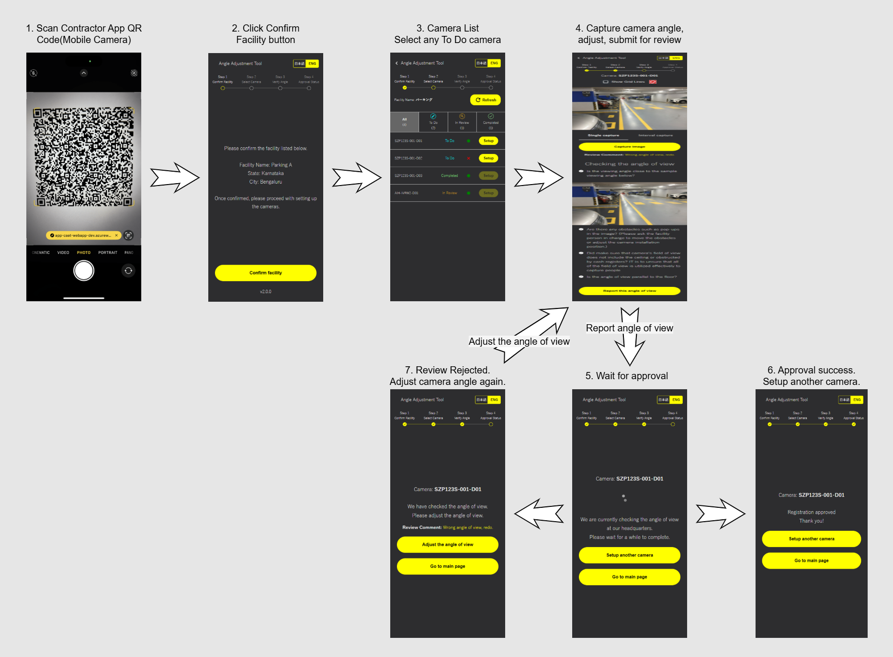
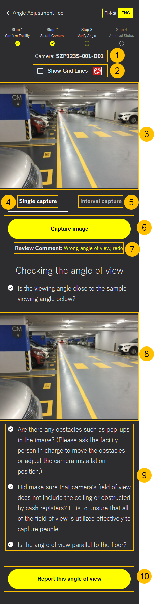

= AAT Contractor App User Guide
:docinfo: shared
:doctype: book
:data-uri:
:title: Angle Adjustment Tool (AAT) - Contractor App User Guide
:revdate: 2025 - 02 - 27
:revnumber: 1.7.0
:toc: left
:toclevels: 3
:toc-title: Table of Contents
:sectanchors:
:sectlinks:
:sectnums:
:multipage-level: 2
:icons: font
:encoding: utf-8

== Recommended environment and usage notes

Recommended environment for Contractor App.

=== Verified operating environment

* OS: Android / iOS
* Browser: Chrome / Safari

=== Recommended display settings

* Display settings
  ** Resolution: 1080 x 2400
  ** Magnification: 100 %

* Browser
  ** Magnification: 100 %

* Font Size
  ** Recommend to use default font size of web browser setting.

== Workflow

The following diagram illustrates the typical workflow of the Contractor App:

.Contractor App Workflow

1. **Scan QR:** Scan the Contractor App QR Code with mobile camera.
2. **Confirm Facility:** Confirm Facility by verifying the displayed facility details.
3. **Camera List:** Select the camera to Setup from the list.
4. **Capture Camera Angle:** Capture the camera image, verify the angle of view and report the angle for review.
5. **Wait for Approval:** Wait for the admin approval for the angle of view reported.
6. **Review Approved:** Once the angle of view reported is approved, proceed to Setup different camera.
7. **Review Rejected:** If the angle of view reported is rejected, try setting up the camera again.

== How to open the App

Scan the Contractor App QR code that came in the box.

[NOTE]
====
Please check with the Admin to get the QR Code.
====

.Contractor App QR Code

To access the Contractor App click on the link detected by the Camera Application in the mobile phone. This will open the Contractor App in the default mobile browser.

1. **Contractor App QR Code:** Scan the Contractor App QR Code provided in the box using the mobile camera app.
2. **Contractor App URL:** The Contractor App URL is shown below the QR code, click it to open the Contractor App.

== How to operate the App

If the QR code is correct, Facility details are displayed. Confirm the Facility to proceed further.

=== Facility Confirmation

.Facility Confirmation Page

1. **Language Change:** Select the desired Language for the App, default language of the application is Japanese.
2. **Progress Bar:** The Progress bar shows the current step in progress, and shows previous passed steps as checked.
3. **Facility Details:** The Facility details has Facility name, State/Province/Region, City/Town for verification.
4. **Confirm Facility:** The Confirm Facility button is used to confirm the facility details mentioned above.
5. **App Version:** The application version is displayed.

=== Camera List

.Camera List

1. **Facility Name:** The Facility Name is displayed.
2. **Refresh:** The Refresh button is used for manually refreshing the camera list.
3. **Status Filters:** There are 3 categories:
+
--
1. To Do - List of all cameras which are currently pending setup.
2. In Review - List of all cameras which are currently in review by the Admin.
3. Completed - List of all cameras which are already setup.
--

4. **Camera:** Each camera is listed, with Name, Status, and Setup button.
5. **Status:** The status of the camera is mentioned to track the progress of the camera setup.
6. **Camera Connection State:** The connectivity state of the camera.
  * Green dot: Camera is online.
  * Red cross: Camera is offline.
7. **Setup:** Each camera in the list has a *Setup* button, which is only enabled for the camera in *To Do* status.

Click the *Setup* button to start adjusting the angle of view of the camera.

=== Verify Camera Angle

.Image Confirmation

.Grid Line Color Picker

1. **Camera Name:** The camera name is mentioned for reference.
2. **Image Grid Lines:** The `Show Grid Lines` checkbox allows user to toggle the visibility of grid lines on the camera and sample image. The palette button next to grid line checkbox opens a color picker to customize the grid line color.
3. **Camera Image:** The latest camera image is shown here.
4. **Single Capture:** Single Capture is used to fetch the camera image only once.
5. **Interval Capture:** Interval Capture is used to fetch the camera image at every 5 second interval.
6. **Capture Image:** The `Capture image` button can be used when in Single Capture mode to manually request for the latest image from the camera.
7. **Review Comment:** If there is any rejection comment by the admin on previous application, review comment is displayed.
8. **Sample Image:** The sample image for the camera is shown here. It is used as a reference image to setup camera.
9. **Steps to follow:** Make sure to follow the steps mentioned while submitting image for review.
10. **Report the angle of view:** Report button is used to submit the angle of view. Admin shall verify the camera angle.

=== Await for confirmation

.Await for Confirmation

1. **Load Icon:** Loading icon indicates that the camera angle review is still under verification.
2. **Setup another Camera:** Contractor can proceed to Setup another camera if there are more cameras to Setup.
3. **Go to main page:** Contractor can go back to the main page, which will display the Facility confirmation page.

=== Approval Status

Once the Admin Approves or Rejects the review, the Contractor can view the status immediately on this page.

==== Review Approved

.Review Approved

1. **Review Approved message:** As soon as Admin approves the review submitted by the Contractor, a message is shown that the review has been approved. The Contractor can now Setup a different camera, or go back to the main page.

==== Review Rejected

.Review Rejected
image::./contractor-app-images/rejected_review.png[Review Rejected <9>, width=150]

1. **Review Rejected message:** If the Admin rejects the review submitted by the Contractor, a message is shown that the review has been rejected. The Contractor can now retry setting up the camera.
2. **Review Comment:** The review comment is shown to the Contractor, which is mentioned by the Admin during rejection of the review. It is to help the Contractor understand what is wrong with the current submission.
3. **Adjust the angle of view:** The Contractor can Adjust the angle of view of the same camera again and submit the camera image with new angle of view.
